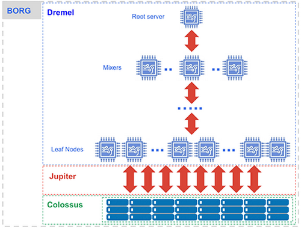

# BigQuery

<!-- - Data Warehouse hosted on GCP
- Link to DataWarehouse doc
- MPP
- Distributed architecture
- Setting up BQ!
- Gemini?
- Making sure Data is secure!

- Link To hello BQ -->
  
## What Is BigQuery?

BigQuery is a [Data Warehouse](https://github.com/CarrierOps/1P-Wiki/blob/main/ByteSizedLearning/TinyTechTidbits/data-lake-and-warehouse.md) service hosted on GCP. Google BigQuery was designed as a “cloud-native" data warehouse. It was built to address the needs of data driven organizations in a cloud first world [Source](https://cloud.google.com/blog/products/data-analytics/new-blog-series-bigquery-explained-overview). Under the hood, BigQuery is composed of 4 main components:
- Dremel
- Colossus
- Borg
- Jupiter
<figure align="center">
    
  <figcaption>BigQuery Under The Hood.</figcaption>
</figure>

To read up on these components visit the [BigQuery Under The Hood](https://cloud.google.com/blog/products/bigquery/bigquery-under-the-hood) article provided by Google.

## Using BigQuery
In order to use BigQuery, knowing is SQL is **HIGHLY** recommended. If you are already comfortable with SQL, then head [here](https://github.com/CarrierOps/1P-Wiki/blob/main/ByteSizedLearning/TinyTechTidbits/CodeMunchies/hello-bigquery.md) to learn how to navigate through BigQuery and to learn about some of its useful features. If you are not familiar with SQL, please  head [here](https://github.com/CarrierOps/1P-Wiki/blob/main/ByteSizedLearning/TinyTechTidbits/CodeMunchies/hello-sql.md) first to get started with some SQL.

