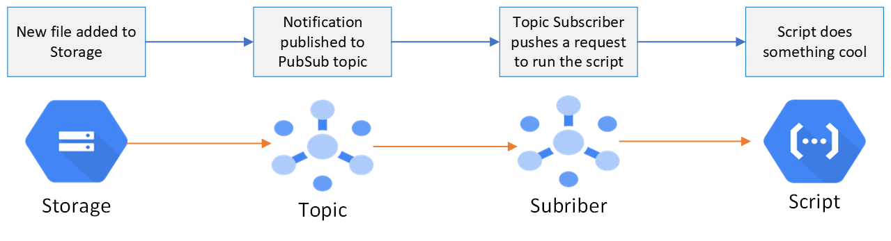

# Pub/Sub Explained

## What is it?

It's a messaging service on GCP. It's a fully managed service that facilitates communication between systems/application/scripts. But what exactly is a messaging service in the context of software?

### Messaging Service

- A messaging service acts as a platform for sending and receiving messages.
- These messages can be anything: text, data, or even binary content.
- The key idea is that communication happens asynchronously, allowing components to interact without being tightly coupled.
- Think of it as a postal service for software—messages are delivered from sender to receiver; from application/software to application/software.

### Components of a Messaging Service

A messaging service has 4 main components (it has others but we won't discuss them here):

- Topics
- Publishers
- Subscribers
- Messages

**Topics**: Intermediary holder of messages. It's essentially the broker that holds all messages before they get sent out to the final destination.

**Publisher**: Creator of the message. The publisher is the one that pushes data/messages that will be consumed downstream. It will push messages to a topic.

**Subscriber**: Consumer of the message. Subscribes to a topic and grabs any and all messages published to the topic by publisher(s).

**Messages**: This is the data being sent and passed from publisher, to the topic, then to the subscriber.

Pub/Sub is just one example of a messaging service. There are others such as, Apache Kafka, RabbitMQ, AWS SQS, etc.

## Why and how do we use it

Messaging services like Pub/Sub have many many use cases such as streaming data, communication between distributed systems/micro-services, creating event-driven processes, etc.

For our use cases, we use Pub/Sub to create an event-driven architecture on GCP. We can look at the image (Fig. 1) below for an example.

Suppose we want a script (Python or other) to run whenever something happens, for example, whenever a new file is added to our storage. Then we can set up a Pub/Sub topic and a notification that publishes a message (in this case just a ping) to that topic. We then set up a Pub/Sub subscriber that is subscribed to that topic to listen for any incoming messages. Whenever a new message gets published to the topic (i.e., a new file is added to our storage), the Pub/Sub subscriber then triggers the script.

- Script triggered via an HTTP POST request. In most use cases, the HTTP POST request is simply used as a trigger, but you can also pass data via this POST request to your script if needed
- Each subscriber can only trigger one script (i.e. only make an HTTP request to 1 pre-defined URL)
- You can have many subscribers per topic. You can trigger many scripts via the same triggering mechanism.
- Subscribers can be setup to use granular permissions for security, and to access secured (via [IAM](https://github.com/CarrierOps/1P-Wiki/blob/main/DocuMentor/gcp/IAM/iam.md)) scripts/applications.
- Subscribers can filter messages so they only receive the ones pertinent to their needs.

<figure align="center">
    
  <figcaption>Fig 1: Message published to topic when a new file is added to our storage. The subscriber then triggers a script to work.</figcaption>
</figure>

## Further reading

You can read over the different sections (found on the left hand side of the page) on [this page](https://cloud.google.com/pubsub/docs/overview) for more in-depth documentation, and basic guided relating to Pub/Sub
