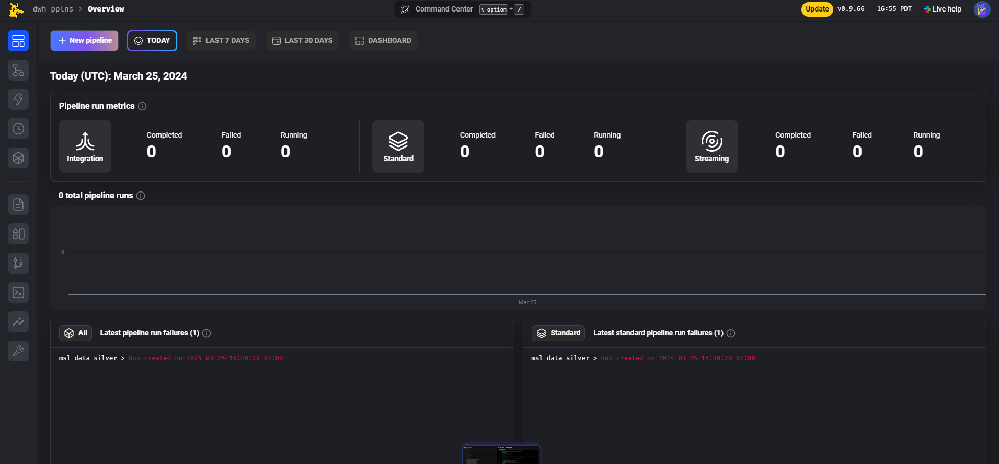

# Mage

Mage is the platform we use to develop & run our data pipelines. It is an orchestration tool. Pipelines are made up of multiple steps (cleaning, filtering, formatting, joining, etc). Mage is the glue between all these steps - it allows us to define in which order each step should happen, and pass data between steps. It allows us to create pipelines from individual steps.

As an orchestrator, Mage lets us to do a lot more than just creating pipelines. It provides us with a mechanism to trigger these pipelines, logging, monitoring, lineage, observability, scalability (i.e. Resource Management), error handling & recovery, and dependency management.

We use Mage locally to develop/edit pipelines, and we also run a [server on Cloud Run](https://github.com/CarrierOps/1P-Wiki/blob/main/DocuMentor/gcp/Cloud-Run/dwh-pipelines.md) as our [production server](https://github.com/CarrierOps/1P-Wiki/blob/main/ByteSizedLearning/TinyTechTidbits/dev-prod.md) that takes care of all data needed for our reporting & analytical needs.

## Intro To Mage

This section will walk you though Mage, how to use it, and the main things to know about it.

If you want to know how to launch mage locally, you can [jump to this section](#developing-pipelines).

Mage comes with a UI (user interface) which makes the experience of developing pipelines easier and more enjoyable. You can do everything via the UI or via you're favorite text editor. This guide will only cover using Mage through the UI.

### Home Page

To get started, launch the [Docker instance](#developing-pipelines) then navigate to [localhost:6789](http://localhost:6789/) from your favorite web-browser. You should see the **following** page:

<figure align="center">
    
<figcaption>Mage Home</figcaption>
</figure>

This is the homepage or landing page. Here a some of the important, most used things on the home page:

<figure align="center">
    
<figcaption>Main Components of Mage home screen</figcaption>
</figure>

- **Red section**: Displays the status of the pipeline runs for the selected time period (succeeded, failed, canceled).
- **Yellow section**: Shows you where you are in the MageUI (navigation helper). You can click on these to navigate back to a given page.
- **green section**: Gives you information about the version you're using and the time (local server time, unless you change in the settings).
- **Blue section**: Contains navigation to different parts of Mage. Here are the numbers that are relevant to the commonly used sections:
  - **1**: The landing page/home screen (current page in the screen shot).
  - **2**: The [pipelines page](#pipelines-page). The page where you can see all your pipelines listed.
  - **3**: The triggers page. The page where all pipeline triggers are listed.
  - **4**: The [pipelines run](#pipeline-runs-page) page. This page lists all pipeline runs, successful or not. It lets you access the logs of the pipeline run and gives you more details.
  - **5** The files page. This page lists all of the files that power your pipelines & the Mage instance. All your pipelines are just a series of .py files and .yaml config files to specify how to string together the .py files. This is where you can see all of these files.
  - **6**: This opens up a terminal for you to run commands (it is running on a Debian linux machine).
  - **7**: The [settings page](#settings-page) is where you can configure various settings related to your pipeline.

To create a pipeline you can click on the blue & purple button labeled `+ New pipeline`. To see or edit existing pipelines, you can click on the [pipelines page](#pipelines-page) then again on the pipeline you want to see. This will bring you to that particular pipeline's page. From there you can go the `Edit pipeline` page to start working on a pipeline.

When you're done creating a pipeline, you can create a trigger for it by going to the pipeline's trigger page and clicking on `New trigger`.

When you're ready to push your pipeline to production, you can push your changes to the dev branch on GitHub, then open up a Pull Request to main.

### Pipelines Page

The pipeline page contains a list of all the pipelines in your Mage project (table in the center of the page). It also contains some metadata about each pipeline such as what [kind of pipeline](#different-kind-of-pipelines) it is, when the pipeline was created, when it was last edited, number of blocks in it, etc.

<figure align="center">
    
<figcaption>Pipelines page</figcaption>
</figure>

Above that table there are a few other options. You can filter your view to see only certain pipelines or you can group them by certain characteristic (status, tag, type). These buttons are the ones highlighted in the green box in the above image.

To create a new pipeline you can click the big blue & purple button in the top left of the page.

> **Note**
>
> When you click the button to create a new pipeline, it will create the new pipeline, generate a random name for it and bring you to a new page. To give a name to your pipeline, navigate back to the `pipelines page`, click once on the newly created pipeline to highlight it, then click the button with the ellipsis (button in the red box in the above image). This button will give you the option to rename the pipeline & to edit its description (highly recommended you give descriptions to your pipelines)

To open up a pipeline, you can either double (left) click on the pipeline or click once on its name (the text in white in the 'name' column of the table). This will bring you a [new page](#individual-pipeline-page) with everything relating to that pipeline

### Pipeline Runs Page

This page gives a overview of all pipeline runs.

<figure align="center">
    
<figcaption>Pipelines Run Page</figcaption>
</figure>

There are a few things to click on to drill down on the view to get more information about a specific run.

If you click on the number in the `Block runs` columns, you will see a page displaying which blocks ran & which failed. You will also be able to access logs of individual blocks and have the option to retry the pipeline from the block(s) that failed. From this page, you can also export the output of individual blocks as CSV files.

<figure align="center">
    
<figcaption>Pipelines Run Page</figcaption>
</figure>

### Settings Page

### Individual Pipeline Page

## More in-depth

Mage is simply a wrapper around your python (and SQL, R, yaml, markdown) files to tie everything together nicely into a pipeline and be able to access them through a UI. A `Mage Project` is the term used to describe a collection of pipelines (& all files related & relevant to the pipelines), or in other words, the top level folder containing all your pipeline scripts is referred to as a `Mage Project`. This mage project will contain some necessary folders such as `data_loaders`, `transformations`, `data exporters` etc that house scripts - `data_loaders` will contain scripts that load data from sources (google sheets, other databases, etc) and so on. You can also add your own folders & files to your Mage project to organize it how you like. When [initiating Mage](https://docs.mage.ai/getting-started/setup), it will automatically create all the necessary folders for you. Here is a diagram illustrating this concept:

<figure align="center">
    
<figcaption>Mage Project</figcaption>
</figure>

Each pipeline in Mage is a sequence of script steps, which can be a mix of Python, SQL, and R, allowing for data to be passed between them. The configuration of a pipeline, including its structure and settings, is delineated in a YAML file located within a specific folder named after the pipeline under the pipelines directory. This is typically named metadata.yaml. Similarly, all pipeline triggers are defined within YAML files, usually named triggers.yaml, and placed in the same folder as the metadata.yaml

### Different kind of pipelines

There are 3 types of pipelines supported in Mage: Batch, Integration, and Streaming.

- **Batch**: Typical pipelines to process data in batches. Get data from source, apply transformations, write to destination (ETL/ELT type pipelines).
- **Integration**: No-code version of batch pipelines that are meant to be used to sync data between systems. For example: syncing data between a client's database and our database, or a SaaS application to our Cloud Storage. Integration pipelines are slower at processing data than batch pipelines and offer less flexibility but are a lot easier to use.
- **Streaming**: Allows you to ingest and transform data in real-time. Accepts incoming streams from various [messaging services](https://github.com/CarrierOps/1P-Wiki/blob/main/ByteSizedLearning/Description%20Of%20Services/pubsub.md#messaging-service), apply in-flight transformations and write to a sink (file storage like GCS, databases like PostgreSQL, or data warehouses like BigQuery).

### Different types of triggers

There are 3 types of triggers: Schedule, Event, and API.

<figure align="center">
    
    <figcaption>Mage Project</figcaption>
</figure>

- **Schedule**: Lets you run your pipelines on a set schedule. The schedule can be defined using a [cron expression](https://github.com/CarrierOps/1P-Wiki/blob/main/ByteSizedLearning/TinyTechTidbits/cron-expressions.md) or preset options using a drop-down menu.
- **Event**: Let's you trigger pipelines when an event happens in the cloud. Example: a new file is uploaded to storage. Currently only supported for AWS. But this functionality can be mimicked using an API trigger, [pubsub](https://github.com/CarrierOps/1P-Wiki/blob/main/ByteSizedLearning/Description%20Of%20Services/pubsub.md) and a script (cloud function, cloud run, etc).
- **API**: This creates an API endpoint which accepts a [POST request](https://github.com/CarrierOps/1P-Wiki/blob/main/ByteSizedLearning/TinyTechTidbits/HTTP.md#method). When a request is made to this endpoint, the pipeline is ran. Data it passed along with the POST request and is used to edit runtime variables.

## Developing pipelines

- Make sure you've installed [all the necessary dependencies](https://github.com/CarrierOps/1P-Wiki/blob/main/ByteSizedLearning/TinyTechTidbits/Setting-up-your-computer.md) on your computer.
- If this is your first time working with 1P's pipelines, you'll need to clone the repository, if not skip to the next step
  - From your command line, navigate to where you want to host the code
    - for example, I host it on a folder in my desktop: `C:\Users\thomas.genet\OneDrive - Acosta, Inc\Desktop\Google Carrier\data_infra`
  - Then enter the command: `git clone --branch dev https://github.com/CarrierOps/pplns_repo`
- From your command line, navigate to the `pplns_repo` directory.
- Then run the following command

```bash
docker run -it -e "USER_CODE_PATH=/home/src/dwh_pplns" -e "GOOGLE_APPLICATION_CREDENTIALS=dev_infra_key.json" -p 6789:6789 -v "%cd%:/home/src" mageai/mageai /app/run_app.sh mage start dwh_pplns
```

> **Note**
>
> - This assumes you have a file named `dev_infra_key.json` in the root of your directory that holds the GCP service account key credentials needed to run the pipelines.
> - It also assumes you've downloaded the image of Mage
> - If not, then run `docker pull mageai/mageai`
> - You can also specify the version (which I suggest) like so: `docker pull mageai/mageai:0.9.67`, in which case you'll need to change `mageai/mageai` to `mageai/mageai:0.9.67` in the docker run command above.

Once you've ran the `docker run` command, open up your favorite browser and navigate to [http://localhost:6789/](http://localhost:6789/).

Happy Coding!
