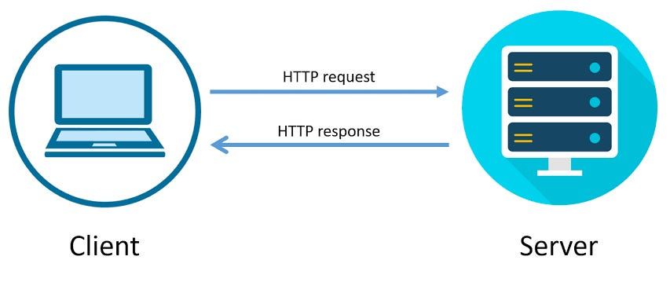
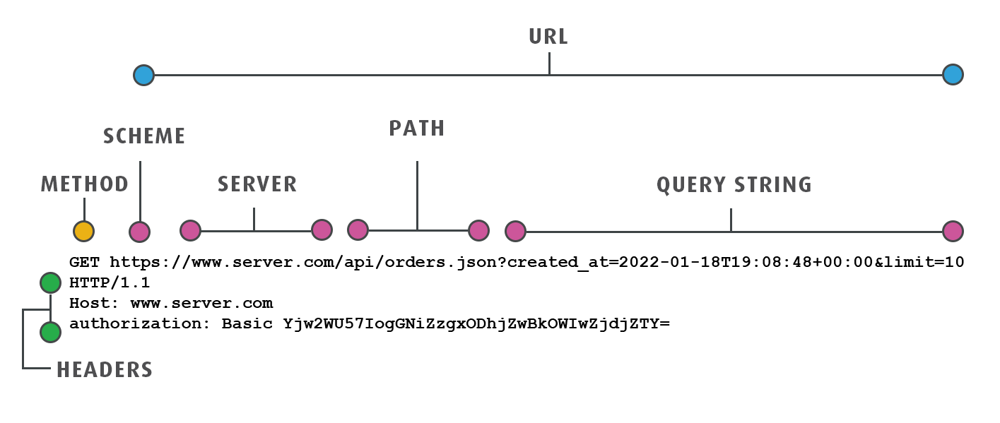

# HTTP

## Introduction

HTTP is a set of rules which govern how data is exchanged on the internet. It operates as a request-response protocol in the client-server computing model.

What is a Client? What is a Server?

<figure align="center">
    
<figcaption>client-server computing model</figcaption>
</figure>

- **Client**: In the context of HTTP, a client is what requests data. For example, when you use a web browser to visit a website, your browser acts as the client.
- **Server**: A server, on the other hand, is where the data lives. It responds to the client's request by sending the requested data back. Websites are hosted on servers.

## HTTP Requests

An HTTP request is initiated by the client and directed towards a server to perform a specific action, identified by a URL (Uniform Resource Locator). The request consists of several key components:

### **Method**

The method indicates the action the client wants the server to perform. Common HTTP methods include (non-exhaustive list):

- **GET**: Retrieve data from the server.
- **POST**: Submit data to be processed to a specified resource.
- **PUT**: Update existing resources.
- **DELETE**: Remove existing resources.
- **HEAD**: Retrieve the headers sent with a response to a GET request, without the response body.

### **URL/URI**

HTTP requests are made to servers identified by URLs. The server could be anything from a web server hosting a website, to an API endpoint providing data or services, to a cloud-based storage service managing files. The specific part of the server or the resource the request is aimed at is detailed in the URL's path and parameters. It can include a query string, which contains additional parameters for the request.

### **Headers**

HTTP headers are key-value pairs sent between clients and servers as part of HTTP requests and responses. They provide essential information about the transaction, such as details about the client or server, the content being transferred, how the content should be handled, and any conditions or parameters that should be applied to the transaction. Headers are sent with the request, but also with the response. Here are some example of headers that are commonly used:

- HTTP Version
  This specifies the HTTP version used in the request, such as HTTP/1.1 or HTTP/2. Each version has different capabilities and features.
- Host: The domain name of the server (required in HTTP/1.1).
- Content-Type: The media type of the body of the request (e.g., application/json, text/html).
- User-Agent: Information about the client making the request.
- Authorization: Credentials for authenticating the client to the server.
- Accept: The media types that the client is willing to receive from the server. 5. Body

Not all requests have a body. Bodies are primarily used with POST and PUT requests to send data to the server. The body of an HTTP request can contain data in various formats, such as JSON, XML, or plain text, depending on what the server accepts and what the request is trying to accomplish.

### HTTP request example

Here is an example of an HTTP request:

```HTTP
GET /index.html HTTP/1.1
Host: www.example.com
User-Agent: Mozilla/5.0 (Windows NT 10.0; Win64; x64)
Accept: text/html,application/xhtml+xml,application/xml;q=0.9,*/*;q=0.8
Accept-Language: en-US,en;q=0.5
Connection: keep-alive
```

- The **Host header** is required in HTTP/1.1 and specifies the domain name of the server (or IP address) and, optionally, the port number.
- The **User-Agent header** identifies the client software making the request to the server.
- The **Accept header** specifies the media types that the client is willing to receive from the server.
- The **Accept-Language header** indicates the client’s preferred languages.
  -The **Connection header** specifies options that are desired for the particular connection and can signal that the connection should be kept open for further requests.

A typical response to this HTTP request may look like this:

```HTTP
HTTP/1.1 200 OK
Date: Wed, 22 Mar 2023 12:34:56 GMT
Server: Apache/2.4.41 (Ubuntu)
Last-Modified: Sat, 18 Mar 2023 14:56:34 GMT
Content-Type: text/html; charset=UTF-8
Content-Length: 3450
Connection: keep-alive
Keep-Alive: timeout=5, max=100
Set-Cookie: UserID=JohnDoe; Expires=Wed, 09 Jun 2024 10:18:14 GMT
Cache-Control: max-age=3600, must-revalidate
Content-Encoding: gzip

<!DOCTYPE html>
<html lang="en">
<head>
    <meta charset="UTF-8">
    <title>Example Page</title>
</head>
<body>
    <h1>Welcome to www.example.com!</h1>
    <p>This is an example of an HTML response to your HTTP request.</p>
</body>
</html>
```

- Status Line: HTTP/1.1 200 OK indicates that the HTTP version is 1.1 and the request has succeeded. The status code 200 is followed by a textual phrase OK describing the status.
- Headers:
  - Date: The date and time the response was sent.
  - Server: Information about the web server software.
  - Last-Modified: The date and time the requested resource was last modified.
  - Content-Type: The media type of the response content; here, it's HTML with UTF-8 character encoding.
  - Content-Length: The length of the response body in bytes.
  - Connection: Instructions for managing the network connection; here, it's kept alive for more requests.
  - Keep-Alive: The directives for the keep-alive connection feature, indicating a timeout and maximum number of requests.
  - Set-Cookie: A cookie named UserID is set for the client, with an expiration date.
  - Cache-Control: Directives for caching mechanisms, indicating that the response can be cached but must be revalidated after an hour.
  - Content-Encoding: Specifies that the content is compressed with gzip.
  - Body: The HTML content of the response, which is what the browser will render. This includes a basic HTML structure with a heading and a paragraph.

This example of an HTTP request + response mimics what goes on behind the scenes when you access `example.com` (made up example) - you make a GET request to the server identified with `example.com` and it returns a webpage (HTML)

- This request can be made from the browser, so when you type `example.com` in the address bar, in which case you'll see the `example.com` page show up (your browser will render the HTML, CSS, & Javascript).
- Or you could have made this HTTP request from a script, in which case you would've simple gotten a text response containing the HTML of that webpage.

Here's a diagram showing the structure of an HTTP request:

<figure align="center">
    
<figcaption>diagram of an HTTP request</figcaption>
</figure>
