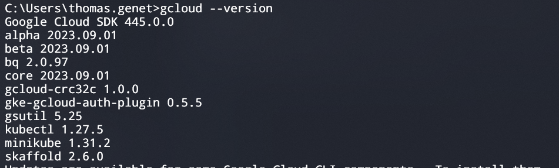

# Set up

To get working on the data infrastructure and any of its components you will need to have a few things installed. Some of which will require you to open up a ticket with IT.

This document will list out all the needed software (the full list as well as the absolute necessary to have, and the nice to have), and will walk you through how to install each of them and test that the installation was successful.

The [first section](#list-of-requirements) will list all requirements and the [second section](#installation-guide) will be an installation guide for each thing in the list

## List of Requirements

All items with an asterisk require IT to install

### Necessary

- Python
- Git
- gcloud \*
- WSL2 \*
- Docker \*

### Nice to have/Optional

- VS Code
- Terraform \*
- NodeJS \*
- GO \*
- Windows longpath \*
- Poetry \*
- GitHub Desktop app
- Windows Terminal

> **!!! IMPORTANT !!!**
>
> WSL2 must be installed before Docker!!!
> Docker requires WSL2 to be installed & working.

## Installation guide

### Python

1. open up the software center 
2. Search for python 
3. Click on python and click "Install"
4. Once the install is done, open up a new command prompt and type in `python --version`. You should see a new line appear saying 'python 3.10.8' like in the screen shot right here: 

- troubleshooting
  - If you see this message `'python' is not recognized as an internal or external command, operable program or batch file.` when entering the command `python -V` it means something went wrong with your installation
  - Open up a ticket with IT. Tell them the problem is most likely that python wasn't added as an environment variable on your system. Tell them to locate the python.exe file and create a variable that points to its path.

### git

Go to [this link](https://git-scm.com/download/win) and download '64-bit Git for Windows Setup.'. This will download an .exe, run it once the download is finish. This will run you through the installation of git as well ask you about configuration preferences. You can leave everything set as the default option (you can always change your settings later).

Once installed, you can check 2 things.

1. You should have git bash installed
   1. Search for 'git' in the windows search bar and look for this app 
   2. If it's there and you can open it, then that's good if not, contact IT.
2. From your command prompt type `git --version`.
   1. You should see something similar to this (don't worry if your version is different than the one in the screenshot): 
   2. If you get something else, such as `'git' is not recognized as an internal or external command, operable program or batch file.` then open up a ticket with IT

### gcloud

1. Navigate to [this website](https://cloud.google.com/sdk/docs/install)
2. go to the Windows section and click on 'gcloud cli installer': 
3. Run the .exe file downloaded in the previous step. It may take a while for the installation to complete, don't worry

To verify that the installation worked, run the command `gcloud --version`. You should see something like this pop up: 

If instead you get a message along the lines of `'gcloud' is not recognized as an internal or external command, operable program or batch file.` or another kind of message, reach out to Thomas & IT.

### WSL2

All septs & more info can be found [here](https://learn.microsoft.com/en-us/windows/wsl/install)

1. Open up Command prompt (or Power Shell) as an admin (you will need IT to remotely access your computer to do this)
2. run the command `systeminfo`
3. Look for "OS Version" in the output 
4. You need to either be running Windows 11 or have a build number $\ge$ 19041 if you're running Windows 10.
   1. If that's not the case, get IT to update your computer to either windows 11 or a windows 10 build $\ge$ 19041
5. Enter the command `wsl --install`
6. You're done! This will have set up WSL2 (not WSL1) with Ubuntu on your machine
   1. You can follow the link above to see how to download new distros
   2. Nobody cares if you chose to use Arch Linux
   3. 

To test that it worked. Open up a new terminal and enter the following command: `wsl -l -v` which should output something similar to this: . 

Then enter the command `wsl` this will launch Linux. **MAKE SURE** to run this while you still have IT helping you as running this command for the first time will finalize the installation.

### Docker

Follow [this link](https://docs.docker.com/desktop/install/windows-install/) for a full list of steps

1. Go to [this link](https://docs.docker.com/desktop/release-notes/) and download the installer for windows (an exe file)
2. Run the exe file downloaded in the previous step
3. During the installation, when prompted to chose between `WSL2` or `Hyper-V`, make sure you chose `WSL2`!!!
4. Continue with the installation until you're done.
5. Once Docker is installed, open the desktop app and run the following commands in the terminal
   1. `docker -v`
      1. You should see something like `Docker version 24.0.5, build ced0996` as the output
   2. run `docker run hello-world`
      1. You should see a `Hello from Docker!` message as the output as well as more text
   3. run these 2 commands in order:
      1. `echo version: '3' > docker-compose.yml && echo services: >> docker-compose.yml && echo   web: >> docker-compose.yml && echo     image: nginx >> docker-compose.yml && echo     ports: >> docker-compose.yml && echo       - "8080:80" >> docker-compose.yml`
      2. `docker-compose up`
         1. You should see things being downloaded and then a webserver running when everything is downloaded
      3. If everything worked well, open a new terminal and run `docker-compose down`

### VS Code

### Terraform

### NodeJS

### GO

### Windows longpath

### Poetry

### GitHub Desktop app

### Windows Terminal
