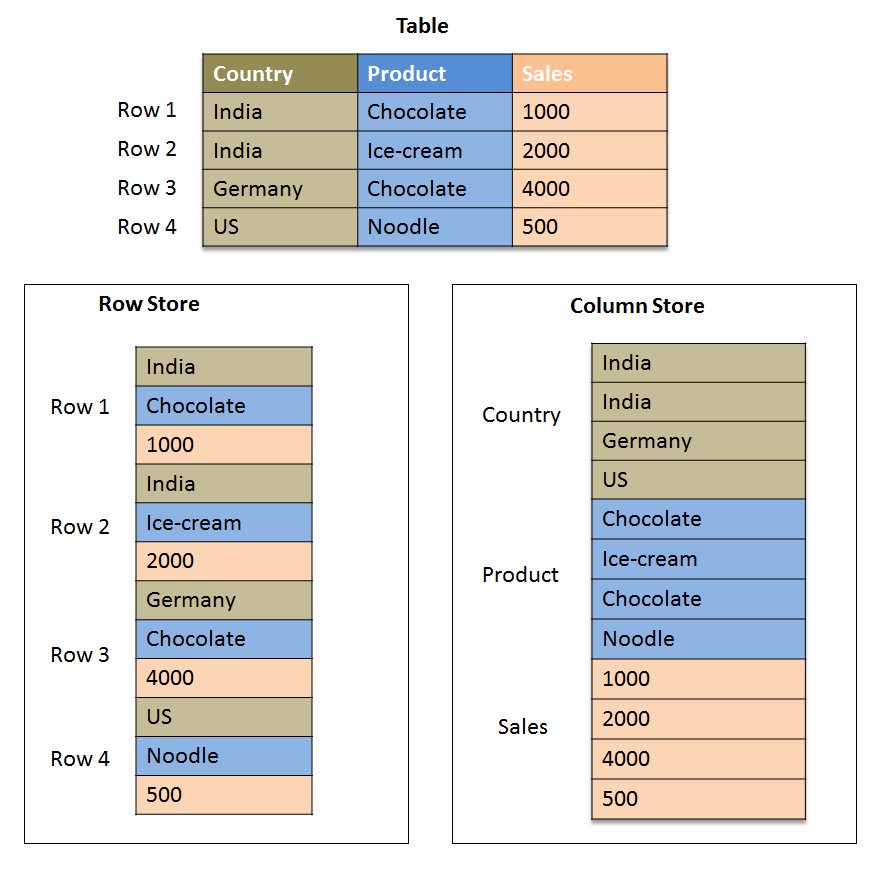

# Row & Columnar storage

Working with data files, like CSV files, is a common task, but the underlying structure of how data is organized in these files can often be overlooked. Essentially, data can be stored in two main ways: by row or by column. Each method has its unique advantages and considerations.

### Storage by Row

Data is stored and organize by row (a.k.a by record), and rows are stored sequentially. This is how popular file formats work, such as CSV & JSON, it's also how most databases store data (PostgreSQL, MySQL, SQL Server, etc).

### Storage by Column

Data is stored and organized by column. Meaning that all data for a particular column is stored together (sequentially). This would be how data is stored in parquet, ORC files and in certain database systems like BigQuery.

Here's a diagram showing the difference.

<figure align="center">
    
<figcaption>row vs col storage</figcaption>
</figure>

## Row vs Columns

Both have their use cases and advantages.

### Row based

Row storage is better suited for OLTP types of data processing - they're better to use for transactional style operations. When you have a transaction, for example a purchase, we will attach a bunch of data to that transaction (for example: transaction id, transaction date, amount, items bought, etc). When inserting the data of the transaction to a database, it is better to insert the transaction as a whole, i.e. as a row, rather than appending each data point of the transaction to each column individually.

Using the above diagram as an example, suppose we get new data that looks like this: country=Canada, Product=Maple-Syrup, Sales=3000. We'd want to append this data to the table. In a row storage (bottom left of the diagram), we could just append the new data as is In a Column storage (bottom right of the diagram), we'd need to iterate through all of our data, and append each new field to the respective column.

So in this scenario (transactional types of operations), row based is vastly better than column based.

### Column based

Column storage is better suited for OLAP types of data processing - they're better to use for analytical needs. Suppose you want to find the sum of the sales column, or you want to find the most recent date in a date type column. If your data was stored in a row-based system, you would need to iterate through every row in your table.

Using the above diagram as an example, suppose we want to know total amount of sales. We'd need to sum up all the number in the 'Sales' column (peach color in the diagram). In a row-based system, we'd need to iterate through all the data, through each row to find & sum all the sales numbers. While in a column based system, we could simply access all values in the sales column only and sum those numbers up.

## Why does it matter?

There are a few major reasons why columns vs row matters, especially for our needs, which are analytical in nature.

When building a transactional type of system, using row-based storage will vastly improve the performance and speed at which you can add new data and work with existing records since.

When doing analytics, it allows you to work only with the data you need which matters for the following reasons:

1. Improves computation time
2. Reduces the load. Instead of running aggregate functions, joins, and etc on all your data, you only run them on the columns you care about. In practice this results in a way way lower cloud bill at the end of the month (since in the cloud you pay for what you use, and in this case you're using a lot less data)

Columnar data brings a whole new dimension of metadata that row-based storage cannot have. Columnar storage allows you to define a schema for your data - allows you to define your column names as well as their types (integer, string, date, etc). This is incredibly valuable information to have built in the storage as it greatly helps when processing the data, when uploading it to databases, etc.

Columnar-storage also always your file sizes to be smaller than row-based storage. Since data is grouped by columns, and each column has a defined type, the data can be better compressed according the the data type.

Here's a table summarizing the differences:

|                    | Columnar Storage                                  | Row Storage                                      |
|--------------------------|---------------------------------------------------|--------------------------------------------------|
| **Data Organization**    | Data is stored by columns.                        | Data is stored by rows.                          |
| **Query Efficiency**     | High efficiency for queries accessing few columns over many rows. | High efficiency for queries accessing many or all columns of a row. |
| **Data Addition**        | Adding new data may be less efficient as it requires updating each column file. | Adding new data is typically more straightforward, by appending new rows. |
| **Compression**          | High compression rates due to uniform data in each column. | Compression rates vary; generally lower than columnar due to mixed data types in rows. |
| **Schema Flexibility**   | Often schema-on-read, offering flexibility at query time. | Typically schema-on-write, requiring schema definition upfront. |
| **Write Performance**    | Generally slower, as updates require modifying multiple column files. | Generally faster, especially for inserting complete new records. |
| **Read Performance**     | Excellent for reading specific columns across many rows. | Excellent for reading complete rows, regardless of the number of columns. |
| **Use Case**             | Suited for analytical and reporting purposes where specific columns are frequently aggregated or scanned. | Suited for transactional databases where entire records are often accessed or modified. |
| **Data Integrity**       | Managing data integrity can be complex due to the separated storage of columns. | Easier to maintain data integrity as entire records are stored together. |
| **Scalability**          | Highly scalable for read-heavy analytical workloads. | Scalable for transactional workloads, with optimizations for row-level operations. |
