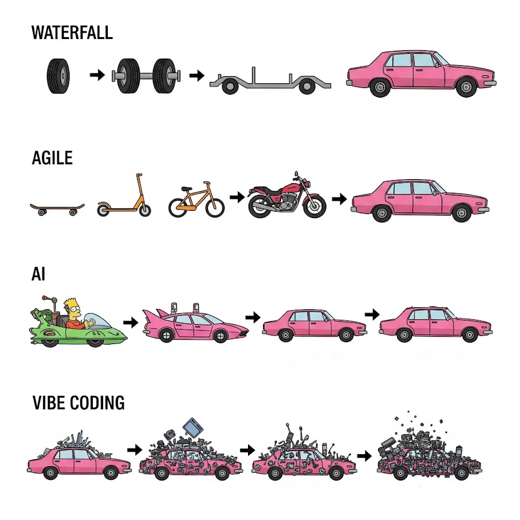

# Data Best Practices

## Brief Overview

This file discusses some of the best design practices with regards to using data within a database for the client. It's important to try to and utilize our data in an efficient way to prevent/minimize exponential growth of incurred costs as well as build more maintainable tools and infrastructure. For a more detailed look into reducing costs, click [here](https://github.com/CarrierOps/1P-Wiki/blob/main/Data Handbook/data_usage_reduction.md).

## Design Mindset

Please analyze **Figure 1** and make sure it makes sense. Please reach out if it does not. In terms of building client facing tools, we should aim to be **AGILE**. In terms of constructing queries that power these tools, we should aim to use the **WATERFALL** approach; hence why it's very encouraged to use **CTEs** & **recursive CTEs** when building queries. It's also good practice to get parts of something working correctly first as opposed to getting everything working all at once i.e. **50% of something is better than a 100% of nothing**. The **AI solutions**, well they might start off great, but they progressively get worse over time...

<figure align="center">
    
  <figcaption>Figure 1: Design Mindset</figcaption>
</figure>

## 4 Design Principles To Be More Efficient

**DRY: Don't Repeat Yourself**

**Examples Of This Principle:**

- Write the same code only once.
- Don't create the same table with a slight difference over and over again.
- Don't create multiple dashboards and visuals that are effectively showing the same thing.

**YAGNI: You Ain't Gonna Need it**

**Examples Of This Principle:**

- Don't write code you don't need now.
- Don't create a whole bunch of tables that are not really necessary.
- Don't create dashboards/views now that you might need down the line or are not really that necessary.

**KISS: Keep It Stupidly Simple**

**The simplest solution is the best solution**. It makes it easier for other to understand and for others to contribute on. Remember that the most complicated problems whether it's in the field of physics, math, economics, business etc have been solved with the **simplest solution**.

**SINE: Simple Is Not Easy**

A simple solution to a complicated problem is often very efficient. Being efficient is not easy, but it's **necessary**.

## Best Practices When Creating Tables

The following points are must haves when making tools from raw data in silver that will be used to power dashboards.

- [Partition & Cluster Your Tables](https://github.com/CarrierOps/1P-Wiki/blob/main/Data Handbook/partitioning_and_clustering.md).  
- Have Only Necessary Columns.
- Simplify Your Logic -> See The 4 Design Principles
- When Prototyping, Only Use A Subset Of The Data In The Dashboard For Testing.

## Nice To Have When Creating Tables

- Use Multiline Comments For Complicated Queries(Especially Useful For CTEs)
- Lineage clearly mapped out with cardinality known.

