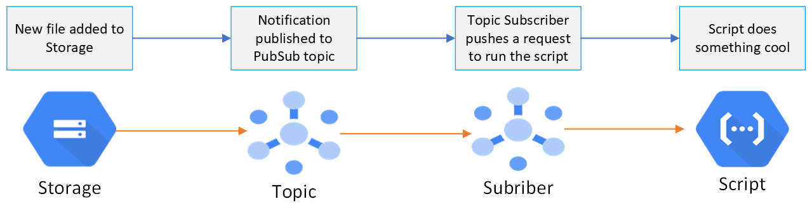

# csv-to-parquet Cloud Function

## Summary

This function converts csv files into parquet files ([see this documentation for csv vs parquet](https://github.com/CarrierOps/1P-Wiki/blob/main/ByteSizedLearning/TinyTechTidbits/row-columnar-file.md)). It looks for csv files in [the-beach-stg](https://github.com/CarrierOps/1P-Wiki/blob/main/DocuMentor/gcp/GCS/bucket_description.md) bucket in GCS and drops the converted parquet file to [the-beach](https://github.com/CarrierOps/1P-Wiki/blob/main/DocuMentor/gcp/GCS/bucket_description.md) bucket. In the event that a parquet file is dropped in `the-beach-stf`, this function will simply move that file over to `the-beach`. If any other kind of file (.txt, .xlsx, .json, .py, etc) is dropped in `the-beach-stg` then this function will do nothing.

This Cloud Function is event-driven; it is triggered & run whenever a new file is dropped into `the-beach-stg` bucket

[see this](#development-operations) section to learn how to edit & redeploy this function

## Diagram

<figure align="center">
    
  <figcaption>Fig 1: Message published to topic when a new file is added to our storage. The subscriber then triggers a script to work.</figcaption>
</figure>

## Development Operations

sdfs