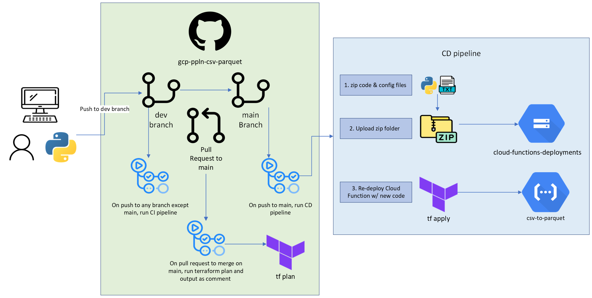

# csv-to-parquet Cloud Function

## Summary

This function converts csv files into parquet files ([see this documentation for csv vs parquet](https://github.com/CarrierOps/1P-Wiki/blob/main/ByteSizedLearning/TinyTechTidbits/row-columnar-file.md)). It looks for csv files in [the-beach-stg](https://github.com/CarrierOps/1P-Wiki/blob/main/DocuMentor/gcp/GCS/bucket_description.md) bucket in GCS and drops the converted parquet file to [the-beach](https://github.com/CarrierOps/1P-Wiki/blob/main/DocuMentor/gcp/GCS/bucket_description.md) bucket. In the event that a parquet file is dropped in `the-beach-stf`, this function will simply move that file over to `the-beach`. If any other kind of file (.txt, .xlsx, .json, .py, etc) is dropped in `the-beach-stg` then this function will do nothing.

This Cloud Function is event-driven; it is triggered & run whenever a new file is dropped into `the-beach-stg` bucket

[see this](#development-operations) section to learn how to edit & redeploy this function

## Diagram

<figure align="center">
    
  <figcaption>High-level diagram showing the how csv-to-parquet Cloud Function works.</figcaption>
</figure>

## Development Operations

This section has 2 sub-sections. The [first one](#editing-the-python-code) walks you through how to edit the python code that is run on Cloud Function. The [second one](#deployment) gives a high-level overview of how the deployment of the code to Cloud Function/GCP works

### Editing the python code

This is done locally, from your computer, so make sure [you're all set up locally](https://github.com/CarrierOps/1P-Wiki/blob/main/ByteSizedLearning/TinyTechTidbits/Setting-up-your-computer.md).

Make sure you're added as a contributor to [the github repo](https://github.com/CarrierOps/gcp-ppln-csv-parquet). (If you click on the link and you can see things, then you're good to go, if not, contact Thomas or Michael to be added as a contributor)

[Clone the repository](https://github.com/CarrierOps/1P-Wiki/blob/main/ByteSizedLearning/TinyTechTidbits/CodeMunchies/hello-github.md#cloning) somewhere that makes sense on your computer (for example, in a folder labeled 'data-infrastructure' inside a folder called 'Google Carrier' on your desktop).

Then open the repository up with your favorite code editor
> :bulb: **Quick-Tip**
>
> - After cloning the github repo, cd into it. From the command line, type 'cd csv-` then hit the <kbd>tab</kbd> to auto-complete then hit <kbd>enter</kbd>
>
> - Then enter the command 'code .'
> - Happy coding!

To edit the code, open up `main.py` which is in the `src` directory.

Do not edit any other file!

> **Note**: You will not be able to run/test the code locally. There are ways to do it. Reach out to Thomas to see how.

### Deployment

<figure align="center">
    
  <figcaption>High-level diagram showing the how csv-to-parquet Cloud Function works.</figcaption>
</figure>