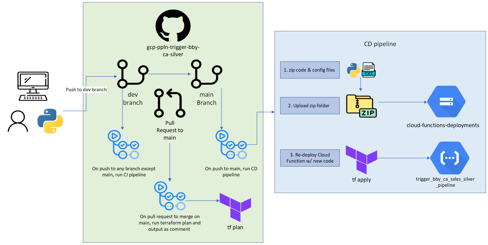

# trigger_bby_ca_silver_ppln

## Summary

This function triggers the `bby_ca_silver` in mage. This cloud function is event driven; it runs every time a new file is placed into the `sell-through` bucket in Google Cloud Storage.  This function contains logic to fire off the mage pipeline only if it's placed in the `raw` subfolder of the  `bby_sellout` folder within the `sell-through` bucket. 

It  trigger the mage pipeline via a post request and passes these runtime variables from the [bby ca pipeline](https://github.com/CarrierOps/1P-Wiki/blob/main/DocuMentor/pipelines/ca_bby.md):

* **bucket_name**: The bucket in which new data gets placed in to.
*  **gcp_projectID**: The project name of everything within our data infrastructure.
*  **layer_env**: The layer in which we are running the pipeline i.e. `dev` or `prod`. For more info about out data layers, click the link [here](https://github.com/CarrierOps/1P-Wiki/blob/main/ByteSizedLearning/TinyTechTidbits/dev-prod.md).
* **path_to_keyfile**: The path to our credentials file that allows us to use various services on our Google Cloud infrastructure. 
* **source_bucket**: The bucket that all of the `clean` and `raw` data for the pipeline can be found.

## Diagram

<figure align="center">
    
  <figcaption>High-level diagram showing the how trigger_bby_ca_silver_ppln Cloud Function works.</figcaption>
</figure>

## Development Operations

This section has 2 sub-sections. The [first one](#editing-the-python-code) walks you through how to edit the python code that is run on Cloud Function. The [second one](#deployment) gives a high-level overview of how the deployment of the code to Cloud Function/GCP works.

### Editing the python code

This is done locally, from your computer, so make sure [you're all set up locally](https://github.com/CarrierOps/1P-Wiki/blob/main/ByteSizedLearning/TinyTechTidbits/Setting-up-your-computer.md).

Make sure you're added as a contributor to [the github repo](https://github.com/CarrierOps/gcp-ppln-trigger-bby-ca-silver.git). (If you click on the link and you can see things, then you're good to go, if not, contact Thomas or Michael to be added as a contributor).

[Clone the repository](https://github.com/CarrierOps/1P-Wiki/blob/main/ByteSizedLearning/TinyTechTidbits/CodeMunchies/hello-github.md#cloning) somewhere that makes sense on your computer (for example, in a folder labeled `data-infrastructure` inside a folder called `Google Carrier` on your desktop).

Then open the repository up with your favorite code editor.

> :bulb: **Quick-Tip**
>
> - After cloning the github repo, cd into it. From the command line, type `cd  gcp-ppln-trigger-bby-ca-silver`
>
> - Then enter the command 'code .'
> - Happy coding!

To edit the code, open up `main.py` which is in the `src` directory.

Do not edit any other file!

> **Note**:
>
> You will not be able to run/test the code locally. There are ways to do it. Reach out to Thomas to see how.

When you're done making edits to the code, push it to GitHub on the dev branch.

### Deployment

Deployment of the python code to Cloud Function on GCP is done automatically.

The tl;dr is that the Cloud Function is deployed using Terraform via GitHub actions.

#### Deployment Workflow

The overall flow of how the code is deployed to GCP is shown in the diagram below.

<figure align="center">
    
  <figcaption>High-level diagram showing the how trigger_bby_ca_silver_ppln Cloud Function DevOps works.</figcaption>
</figure>

- Code is edited locally (on your computer), then pushed to GitHub on the dev branch.
- When pushes are made to the GitHub repo on any branch other than main, it kicks off a CI (continuous integration) pipeline.
  - this CI pipeline is run via [GitHub actions](https://github.com/CarrierOps/1P-Wiki/blob/main/ByteSizedLearning/TinyTechTidbits/CodeMunchies/hello-github.md#github-actions).
  - It runs things like formatters, security checks, unit tests, etc.
  - It is a WIP in progress.
- When a Pull Request (PR) is made to main, another action is kicked off to get the terraform plan and write as a comment in the PR.
- When the PR is accepted and merged into main, the CD (continuous deployment) pipeline is kicked off.
  - Also run via GitHub actions.
  1. Takes all relevant files to run the code (.py files, requirements.txt, any other config files).
  2. Creates a zip folder with these files.
  3. Pushes the zip folder to a bucket in GCS.
  4. Runs `terraform apply` to deploy/re-deploy the cloud function with the latest code changes.

> :exclamation: **Important** :exclamation:
>
> It is vital for the code (.py files and all) to be added to the GCS bucket or else terraform won't redeploy the Cloud Function!
>
> Terraform only tracks state changes in infrastructure, not code or files (that's what Git does). So in order to trigger a state change in the infrastructure, we created a special bucket in GCS to house the zip folders of the code files of all cloud functions. This bucket & all subfolders are managed/tracked by terraform.
>
> This means that while terraform can't track changes in the files of those sub-folders, it can track the change that a new file was added.
>
> Through this mechanism, terraform is able to recognize a state change and then re-deploy the cloud function with the latest code changes.
