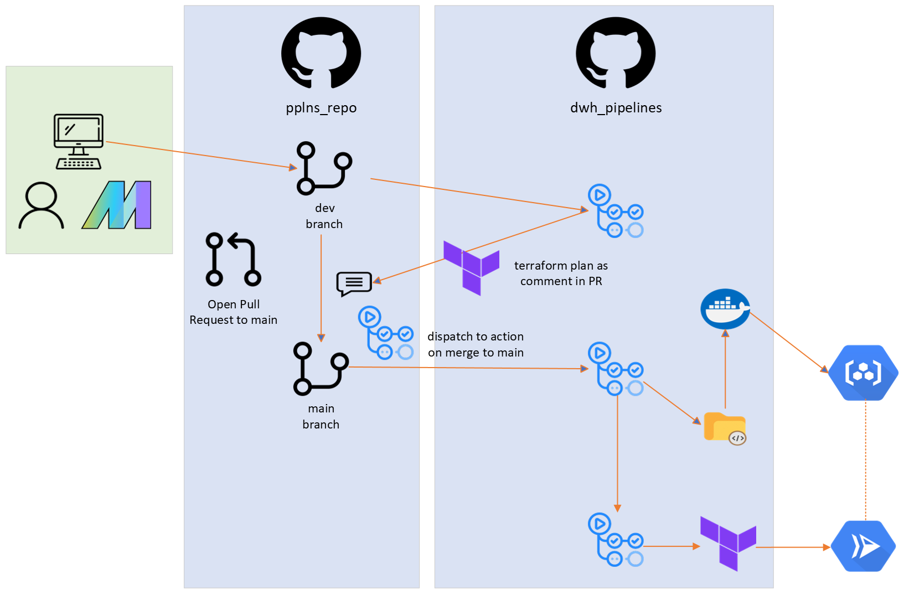

# dwh-pipelines

This Cloud Run services runs the [Mage](https://github.com/CarrierOps/1P-Wiki/blob/main/DocuMentor/platforms/Mage.md) production server - the server with all of our pipelines running on [production data](https://github.com/CarrierOps/1P-Wiki/blob/main/ByteSizedLearning/TinyTechTidbits/dev-prod.md).

## Development Operations

### Developing pipelines

To develop/edit pipelines, checkout [this documentation](https://github.com/CarrierOps/1P-Wiki/blob/main/DocuMentor/platforms/Mage.md)

### Deployment

The deployment process (CI/CD) for this application involves a game of ping-pong between 2 Github repositories - [pplns_repo](https://github.com/CarrierOps/pplns_repo) and [dwh_pipelines](https://github.com/CarrierOps/dwh_pipelines). pplns_repo contains all the pipeline code, and dwh_pipelines contains all deployment code (terraform & github actions). pplns_repo is a [submodule](https://gist.github.com/gitaarik/8735255) of dwh_pipelines.

- Pipelines are developed in `pplns_repo`.
- When they are ready to push to [production](https://github.com/CarrierOps/1P-Wiki/blob/main/ByteSizedLearning/TinyTechTidbits/dev-prod.md), a pull request to main is opened.
- This will fire off a GitHub action in `pplns_repo` which triggers another action in `dwh_pipelines` that generates the terraform plan with the most recent changes (to both repos)
- The terraform plan is then attached as a comment in the pull request in `pplns_repo`
- When the pull request is accepted & merged to main an action in `pplns_repo` triggers another action in `dwh_pipelines`, this time passing along data. It passes the sha of the latest commit in `pplns_repo`.
- The action in `dwh_pipelines` builds a docker image of the pipelines, tagging with 'latest' and the commit sha passed from `pplns_repo`.
- It then pushes that image to Artifact Registry on GCP
- It then triggers the next action in `dwh_pipelines`.
- This action runs the terraform scripts to re-deploy the pipelines to Cloud Run using the latest image pushed to Artifact Registry. It also deploys all peripheral infrastructure supporting the cloud run app (ex: Cloud SQL, IAM, GCS, etc).

Here is a diagram of the process:

<figure align="center">
    
<figcaption>client-server computing model</figcaption>
</figure>
