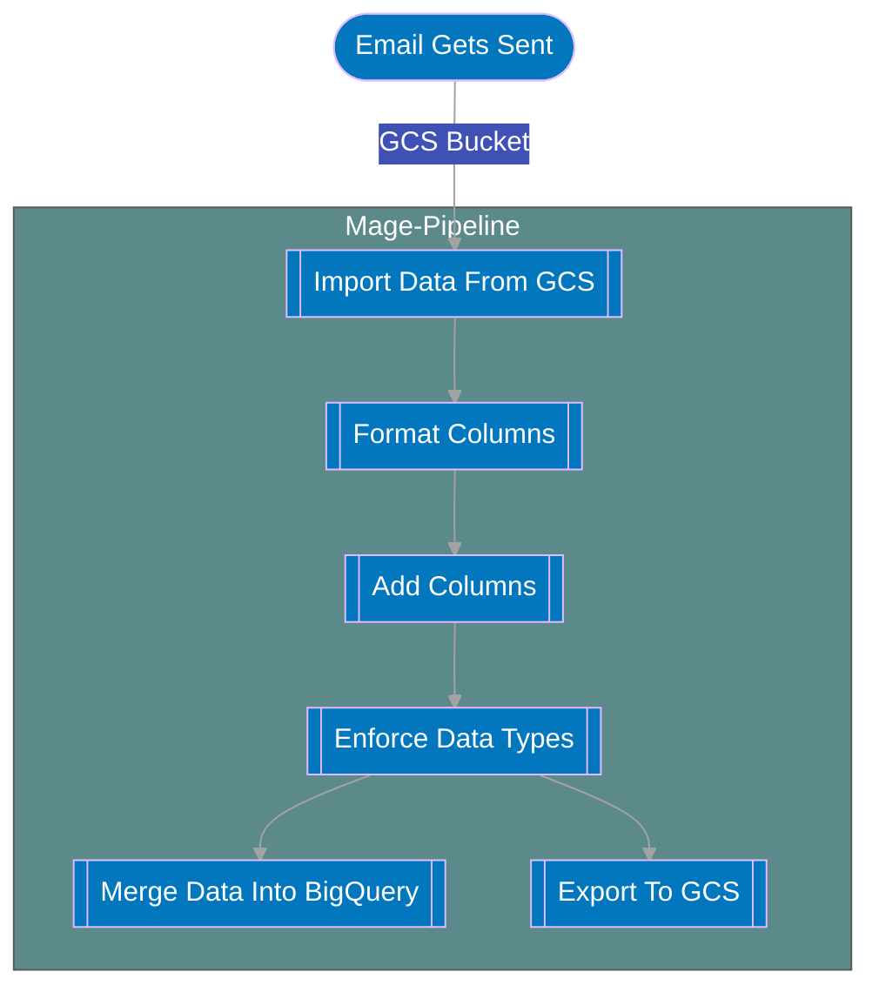

# Bell Sales Pipeline

## Summary
The bell sales pipeline gets data that is sent by email and brings that data into BigQuery.

## Cadence 
TBD

## Flowchart

## Extra Detail In Flowchart

1. **Mention getting data from email into GCS process once done**
2. Once the data from the email gets put into the `raw` subfolder of  `bell_sales` within `sell-through`, the bell pipeline with activate.
3. The columns are renamed and formatted into snake case.
4. A unique id column called uid is created so that every row of data has a unique identifier. 2 extra columns are created that split up a column `item_description` into `product` and `product_details`.
5. The data types of the columns are then enforced to ensure data consistency.
6. The new bell data is then exported to BigQuery and GCS.

## Links Associated To The TMO Pipeline

Link: [BigQuery Table](https://console.cloud.google.com/bigquery?authuser=0&project=orbital-airfoil-393318&rapt=AEjHL4MQGxR14ITxKzKSxlttegyNL5W_VbOzrA-vEkwn0q4DOE30aT7RgvuJrQLUn9YWnANgHCHTXTmdJgF_u59H8W-AyCBUp-18Vy0rzv9mhwUZh0HvqPI&ws=!1m14!1m3!8m2!1s788520541806!2s9992369137a0431f9799a846129aec26!1m4!1m3!1sorbital-airfoil-393318!2sbquxjob_5c318b07_18fe9301e59!3sUS!1m4!4m3!1sorbital-airfoil-393318!2ssilver_layer!3sbell_sales_data&pli=1&cloudshell=true)

