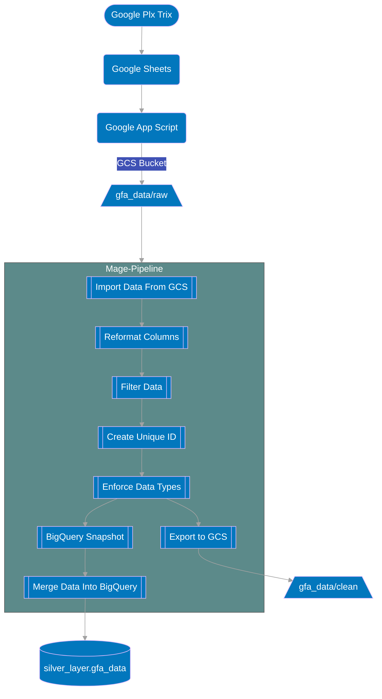

# GFA Pipeline Documentation

## Sumary
The GFA pipeline takes data daily from a Google plx trix and brings that data into BigQuery. GFA data mainly pertains to survey data collected by field representatives.

## Cadence
The pipeline is scheduled to run **every day at ~9am EST**.

## Flowchart

## Extra Details In Flowchart

1. A Google Plx Trix is setup to pull the `GFA` data into a google sheet daily.
2. A Google App Script is used to extract the daily data from the Plx Trix which will be stored in GCS as well as be used to fire off the pipeline. A new file added into the `raw` subfolder of the `gfa_data` bucket is what is used to trigger a pipeline run.
3. Reformat columns ensures columns are in snake case i.e. snake_case
4. Null date times are filtered out as it prevents proper data type enforcement.
5. The uid is created from the concatenation of `store_visit_activity_id`, `survey_question_id`, and `response_value`
6. The `uid` is needed for the `Merge Data Into BigQuery block` as it in ensures that every single entry is unique and no data will be added into the table in BigQuery where the uid already exists.
7. A snapshot of the current table in BigQuery is made as a local backup before the Merge Data step.

## Links Associated To The GFA Pipeline
### Google Cloud Storage(GCS)
Link: [GFA GCS](https://console.cloud.google.com/storage/browser/gfa_data;tab=objects?forceOnBucketsSortingFiltering=true&authuser=0&project=orbital-airfoil-393318&prefix=&forceOnObjectsSortingFiltering=false)

The raw folder is where the raw data is stored and retrieved.
The clean folder is where the data that is exported from the GFA pipeline is stored.

### BigQuery

Link: [GFA Data In BigQuery](https://console.cloud.google.com/bigquery?referrer=search&authuser=0&project=orbital-airfoil-393318&ws=!1m13!1m3!8m2!1s788520541806!2sec894000df164909abfd085a6b226497!1m3!8m2!1s788520541806!2s566a4afb7e8f4248852f366291272b93!1m4!4m3!1sorbital-airfoil-393318!2ssilver_layer!3sgfa_data&rapt=AEjHL4P2Aj3Y_3y1lr9qjXMkE81QjHY1rnPyy4fSUwgdCq-kZxQ0eVvXh6B5msvwDWyBpmXY1OatLBl-_UhelmLO-0yf5_EmwNwVLIrCvqetfkngIwSIWV8)

The main table for GFA in Big Query is `silver_layer.gfa_data`

### Google Plx Trix
This is where the data gets refreshed and taken into GCS.

Link: [Google Plx Trix](https://docs.google.com/spreadsheets/d/1ZRD9BfhBz9WYWz7ZxwtO-6X_1t5XkLCvu39b8ifZSK0/edit#gid=156467221)

