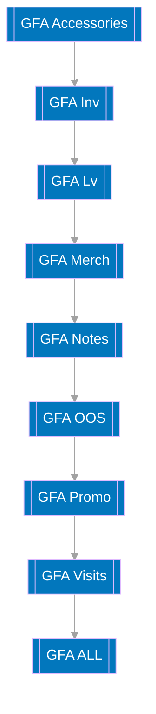

# GFA Gold And Platinum Table Pipeline

## Summary
This pipeline creates all of the gold and platinum GFA tables. 

## Cadence
This pipeline fires immediately after the `gfa_silver` pipeline finishes running.

## Flowchart

## Extra Detail In FLowchart

1. All of these blocks are using SQL to create table within BigQuery. No data is imported or export. These blocks simply instruct BigQuery to perform tasks using SQL.
2. The team can write what they want to do using SQL, and have them directly orchestrated in Mage.

