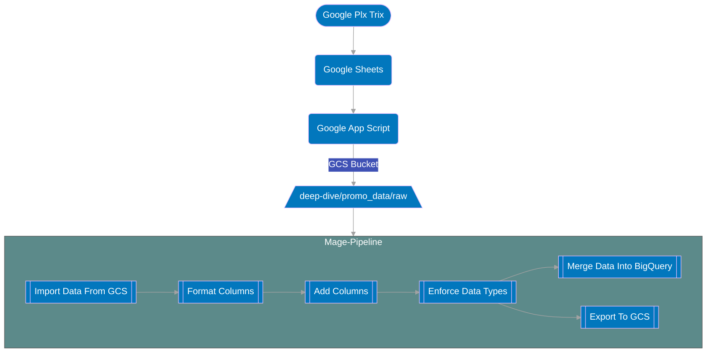

# Promo Data Pipeline

## Summary 

This pipeline gets merchandise promotion data from a google plx trix and ingests that data into BigQuery.

## Cadence
TBD

## Extra Detail In Flowchart

1. Once data is put into the `raw` subfolder of the `promo_data` folder within `deep-dives`, the the promo_data pipeline will fire off.
2. The columns are then renamed appropriately and formatted in snake case format.
3. A unique id columns called `uid` is created to ensure that every row of data has a unique identifier associated with it.
4. Proper data types are then enforced to ensure data consistency before exporting to Google Cloud Storage and BigQuery.
5. The cleaned and formatted data is then exported to Google Cloud Storage and BigQuery.

 ## Links Associated To The TMO Pipeline

Link: [Promo Data In BQ](https://console.cloud.google.com/bigquery?authuser=0&project=orbital-airfoil-393318&rapt=AEjHL4NkUdaW8JlodrSEizvSq5l90Vp0uv8VMngEce2UvcMd92FvuBNRuS64C2ok5kWsqIGTljbmis_VJmHtGLQxw0EuTLxznpBpzVmo7OmMaTtJSWFzKs8&ws=!1m5!1m4!4m3!1sorbital-airfoil-393318!2ssilver_layer!3spromo_data&pli=1)

