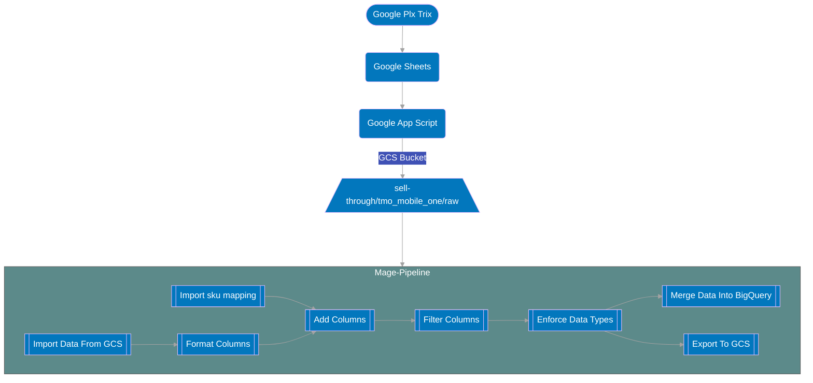

# TMO Sales Data Documentation

## Summary
The TMO sales data pipeline takes data from a Google Plx Trix and brings that data into BigQuery.

## Cadence
The pipeline is schedule to run on **Monday's at 1pm PST and Friday's at 1pm PST**.

## Flowchart

## Extra Detail In FLowchart

1. A Google App Script is used to grab data from a Google Sheet that contains is updated weekly with the new tmo data.
2. A Google App Script is used to extract the weekly data from the Google Sheet which will be stored in GCS as well as be used to fire off the pipeline. The data will be sent to the `raw` subfolder of `tmo_mobile_one` folder within `sell-through`.
3. Columns are then formatted and renamed accordingly such that they are in snake case.
4. We then take the tmo sales data and `LEFT JOIN `it with the sku code mapping such that we can get the product associated with the sale.
5. We also add a column called `uid` which creates a unique identifier for each row of data in the table.
6. We then filter down the columns such that we are only using/exporting the columns that are are needed.
7. Data types are then enforced to ensure the consistency of the data.
8. The data is then exported to BigQuery using a `MERGE STATEMENT` and GCS a clean `parquet` file is sent to the `clean` subfolder with the `tmo_mobile_one` folder.

## Links Associated To The TMO Pipeline

Link: [TMO Sales In BQ](https://console.cloud.google.com/bigquery?authuser=0&project=orbital-airfoil-393318&rapt=AEjHL4OSbMOfMW9ragYClynbCLR-eVaFfxF0Uzm8_uhPqTknhtY4FuIWenzDuoZNZwnFHZ3Brp1-NEyzjBHMRNaXzLH2C7o-qeBQlBhH1A_9YERVMtbcXxo&ws=!1m5!1m4!4m3!1sorbital-airfoil-393318!2ssilver_layer!3stmo_mobile_one_sales&pli=1&cloudshell=true)

Link: [TMO SKU Mapping In BQ](https://console.cloud.google.com/bigquery?authuser=0&project=orbital-airfoil-393318&rapt=AEjHL4OSbMOfMW9ragYClynbCLR-eVaFfxF0Uzm8_uhPqTknhtY4FuIWenzDuoZNZwnFHZ3Brp1-NEyzjBHMRNaXzLH2C7o-qeBQlBhH1A_9YERVMtbcXxo&ws=!1m5!1m4!4m3!1sorbital-airfoil-393318!2ssilver_layer!3stmo_sku_code_mapping&pli=1&cloudshell=true)