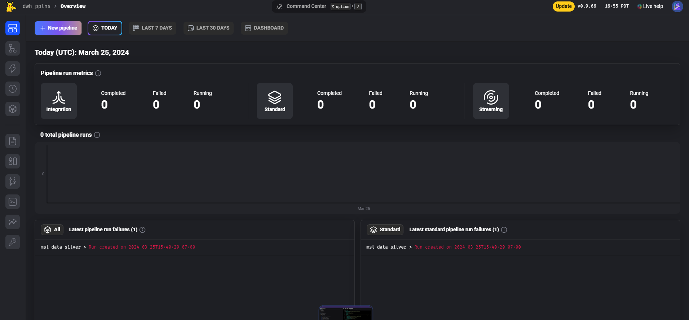
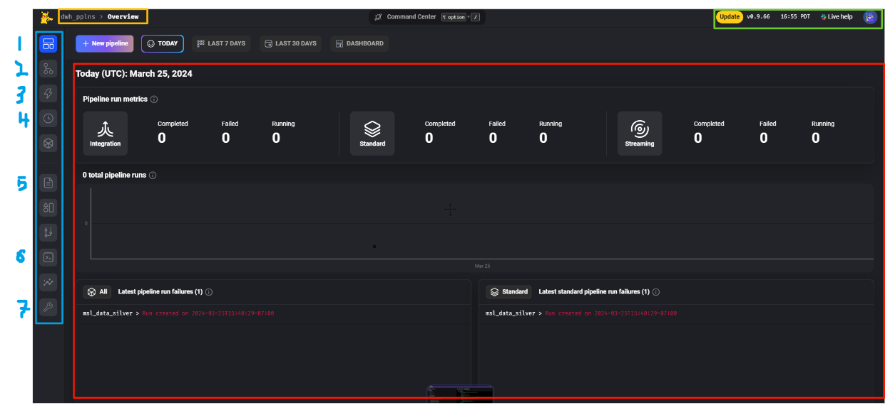

# Mage

Mage is the platform on which we develop & use to run our data pipelines. It is an orchestration tool; each pipeline is made up of multiple steps (cleaning, filtering, formatting, joining, etc). Mage is the glue between all these steps - it allows us to define in which order each step should happen, and pass data between steps. It always us to create pipelines from individual steps.

As an orchestrator, Mage allows us to do a lot more than just creating pipelines. It provides us with a mechanism to trigger these pipelines (via a set schedule or on demand via an API), logging, monitoring, lineage, observability, scalability (i.e. Resource Management), error handling & Recovery, and dependency management.

We use Mage locally to develop/edit pipelines, and we also run a [server on Cloud Run](https://github.com/CarrierOps/1P-Wiki/blob/main/DocuMentor/gcp/Cloud-Run/dwh-pipelines.md) as our production server that takes care of all data power our reporting & analytical needs.

## Intro to Mage

This section will walk you though Mage, how to use it, and the main things to know about it.

Mage comes with a UI (user interface) which makes the experience of developing pipelines easier and more enjoyable. You can do everything via the UI or via you're favorite text editor. This guide will only cover using Mage through the UI.

### Home Page

To get started, launch the [Docker instance](#developing-pipelines) then navigate to [localhost:6789](http://localhost:6789/) from your favorite web-browser. You should see the following page:

<figure align="center">
    
<figcaption>Mage Home</figcaption>
</figure>

This is the homepage or landing page. Here's what each main section represents:

<figure align="center">
    
<figcaption>Main Components of Mage home screen</figcaption>
</figure>

- **red section**: displays the status of the pipeline runs for the selected time period (succeeded, failed, canceled)
- **yellow section**: Shows you where you are in the MageUI (navigation helper). You can click on these to navigate back to a given page.
- **green section**: gives you information about the version you're using and the time (local server time, unless you change in the settings)
- **blue section**: contains navigation to different parts of Mage. We've numbers the relevant and commonly used sections:
  - **1**: The landing page/home screen (current page in the screen shot)
  - **2**: The [pipelines page](#pipelines-page). The page where you can see all your pipelines listed
  - **3**: The triggers page. Page where all pipeline triggers are listed. 
  - **4**: the [pipelines run](#pipeline-runs-page) page. This page lists all pipeline runs, successful or not. Let's you access the logs of the run and get more details.
  - **5** The files page. This page lists all files that power your pipelines & the Mage instance. All your pipelines are just a series of .py files and yaml config files to specify how to string together the .py files. This is where you can see all of these files.
  - **6**: This opens up a terminal for you to run commands (it is running on a Debian linux machine).
  - **7**: The [settings page](#settings-page) where can can configure various things.

### pipelines page

### pipeline runs page

### settings page

## Developing pipelines


- Make you've installed [all the necessary dependencies](https://github.com/CarrierOps/1P-Wiki/blob/main/ByteSizedLearning/TinyTechTidbits/Setting-up-your-computer.md) on your computer.
- If this is your first time working with 1P's pipelines, you'll need to clone the repository, if not skip to the next step
  - From your command line, navigate to where you want to host the code
    - for example, I host it on a folder in my desktop: `C:\Users\thomas.genet\OneDrive - Acosta, Inc\Desktop\Google Carrier\data_infra`
  - Then enter the command: `git clone --branch dev https://github.com/CarrierOps/pplns_repo`
- From your command line, navigate to the `pplns_repo` directory.
- Then run the following command

```bash
docker run -it -e "USER_CODE_PATH=/home/src/dwh_pplns" -e "GOOGLE_APPLICATION_CREDENTIALS=dev_infra_key.json" -p 6789:6789 -v "%cd%:/home/src" mageai/mageai /app/run_app.sh mage start dwh_pplns
```

> **Note**
>
> - This assume you have a file named `dev_infra_key.json` in the root of your directory that holds teh GCP service account key credentials needed to run the pipelines.
> - It also assumes you've downloaded the image of Mage
> - If not, then run `docker pull mageai/mageai`
> - You can also specify the version (which I suggest) like so: `docker pull mageai/mageai:0.9.67`, in which case you'll need to change `mageai/mageai` to `mageai/mageai:0.9.67` in the docker run command above.

Once you've ran the `docker run` command, open up your favorite browser and navigate to [http://localhost:6789/](http://localhost:6789/).

Happy Coding!
