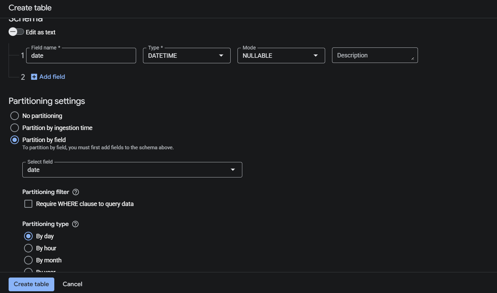
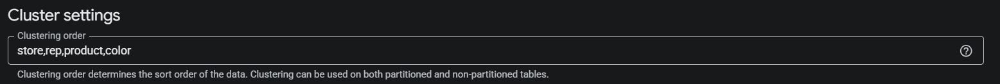

# Partitioning & Clustering

## Brief Summary:

Partitioning and clustering your tables and a really simple way to get data usage savings with effectively zero cost. Zero risk non zero reward 👌.

## Reasoning and Background

When a **Looker Studio** dashboard is connected to tables within BigQuery, each time a filter is a applied, a full `table scan` is performed. Think of a `table scan` as a ``` Select * ``` from a table. Below is a random example of a query that **Looker Studio** will perform when a filter is applied to a dashboard.

```
SELECT SUM(clmn4_) AS t0_D3547866113735134102, SUM(clmn0_) AS t0_D3905135194959554656, COUNT(DISTINCT clmn5_) AS t0_D9495558218080202281 FROM (
SELECT clmn1_ AS clmn6_, clmn3_ AS clmn7_, clmn0_, clmn2_, clmn4_, clmn5_ FROM (
SELECT t0.open_loa AS clmn0_, t0.relative_cycle_label AS clmn1_, t0.relative_quarter_label AS clmn2_, t0.territory AS clmn3_, t0.weekly_visit_target AS clmn4_, t0.year_week AS clmn5_ FROM `orbital-airfoil-393318.gold_layer.field_exec_targets_actuals` AS t0
)
) WHERE (clmn7_ IN ('Cleveland, OH') AND clmn2_ IN ('Current') AND clmn6_ IN ('Current Cycle')) LIMIT 2000001;

```

**Partitioning & Clustering** gives BigQuery Metadata about our tables which allows it to segment the data into `partitions`. The standard practice is to partition by the the column that changes the most with time which is just usually the main `Date` column. `Clustering` further organizes the `partitions` such that the columns within each `partition` are further organized.


## What are the Benefit of Partitioning & Clustering?

A properly setup Looker Studio dashboard with a `partitioned` table can save up to `99% data usage` when applying filters to a dashboard. The amount of savings depending on big of a range is applied to the `partitioned` column. The smaller and more refined the range, the bigger the savings!!!

## How to Properly Setup A Partitioned & Clustered Table Linked To A Dashboard?

### By Using Code:
```
CREATE OR REPLACE TABLE {data_layer.table_name}

Partition by date_column

Cluster by col_1, col_2, col_3, col_4

As

{query}


```

### By Using the Bigquery User Interface

<figure align="center">
    
  <figcaption>Figure 1: BigQuery Partitioning</figcaption>
</figure>


<figure align="center">
    
  <figcaption>Figure 2: BigQuery Clustering</figcaption>
</figure>


**NOTE:** Whatever you use as your partition & cluster must be the main filters in your dashboard since those columns are what BihgQuery has metadata on!