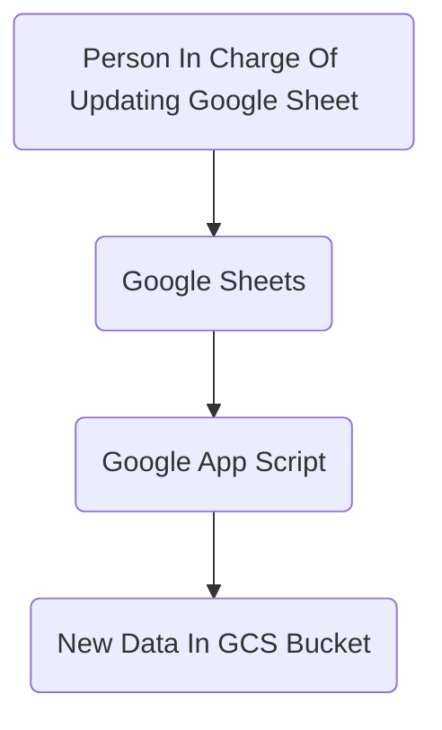

m
# Summary
The ATT pipeline takes data from a Google Sheet and brings that data into BigQuery.

## Flowchart

```mermaid
flowchart TD
id0(Person In Charge Of Updating Google Sheet)
id00(Google Sheets)
id000(Google App Script)
id0000(New Data In GCS Bucket)
id0-->id00
id00 --> id000
id000 --> id0000


```