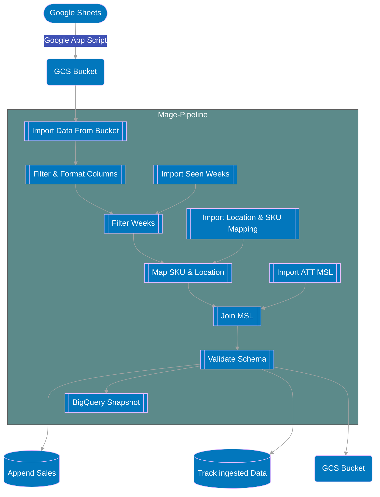
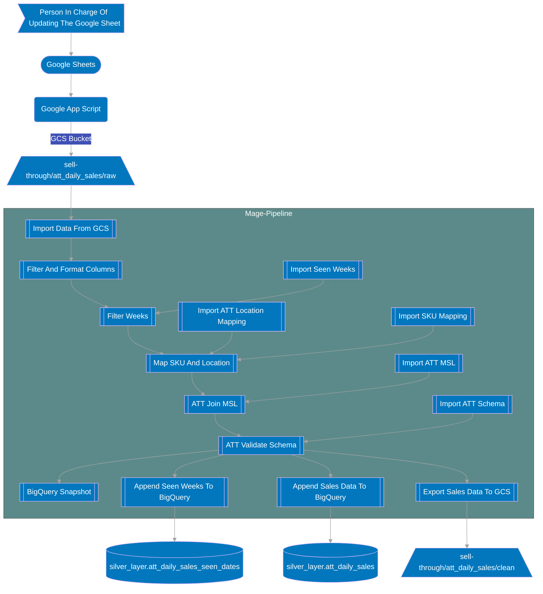

# Summary

The ATT pipeline takes data from a Google Sheet and brings that data into BigQuery.

## Cadence

**12pm EST - 3pm EST**

The pipeline is scheduled to run every Tuesday from within the range of 12pm ~ 3pm EST. Since the data that gets updated is done manually, and is not done on a set schedule, the att pipeline run will vary until we see that the new data is in. Note that this is not the case for the other pipelines.

## Flowchart

            

## Extra Details In Flowchart

1. New sales data is manually added to a google sheet usually every Tuesday.
2. A google app script is used to extract the data from the plx trix to be stored in GCS as well as used to fire off the pipeline. Any new file added into the `raw` subfolders of the `sell-through` bucket is what is used to trigger a pipeline run.
3. Once the data is imported into the Mage pipeline, we then filter the columns such that all columns are in snake case i.e. snake_case and we are only selecting the columns that we actually need.
4. Once the new data from GCS is imported into the Mage pipeline, we also import the seen weeks of the activations data from the table `silver_layer.att_daily_sales_seen_weeks`. By doing this, we avoid we avoid duplicate records and make sure that each pipeline run contains new data
5. Map SKU And Location creates a dictionary of the form {'att_SKU_code': SKU}. The `phone` column is then added to data by mapping the `location_number` to `cp_id`. The tables needed to get this data are `silver_layer.att_location_mapping` and `silver_layer.sku_code_mapping`.
6. The ATT sales data is then merged with the `att_msl` table in BigQuery using a `LEFT JOIN`.
7. The data is then filtered by removing duplicate `cp_id` and removing null values in the `cp_id` column.
8. The schema and data types of the sales data are then validated.
9. A snapshot of the sales data is then taken.
10. The sales data is then appended to BigQuery
11. The seen weeks are also appended to BigQuery.
12. The sales data is also exported to GCS in the `clean` subfolder.

## Links Associated To The ATT Pipeline

### Google Cloud Storage(GCS)

Link: [Google Cloud Storage](<https://console.cloud.google.com/storage/browser/sell-through/att_daily_sales?pageState=(%22StorageObjectListTable%22:(%22f%22:%22%255B%255D%22))&authuser=0&project=orbital-airfoil-393318&prefix=&forceOnObjectsSortingFiltering=false>)

### BigQuery

Link: [Main Table](https://console.cloud.google.com/bigquery?referrer=search&authuser=0&project=orbital-airfoil-393318&ws=!1m5!1m4!4m3!1sorbital-airfoil-393318!2ssilver_layer!3satt_daily_sales&rapt=AEjHL4PAMMTnRDeY0yzTwqAM3HhXa11et6cM_qucPY7Guz45cI5yQR6gSTBhX_u4a55Hm17vvulXf1VL5vJfSJhOnKgGD_OXQlqdr-pTxJ7q5J0MfZRASUU&pli=1)

Link: [Seen Dates Table](https://console.cloud.google.com/bigquery?referrer=search&authuser=0&project=orbital-airfoil-393318&ws=!1m5!1m4!4m3!1sorbital-airfoil-393318!2ssilver_layer!3satt_daily_sales_seen_dates&rapt=AEjHL4PAMMTnRDeY0yzTwqAM3HhXa11et6cM_qucPY7Guz45cI5yQR6gSTBhX_u4a55Hm17vvulXf1VL5vJfSJhOnKgGD_OXQlqdr-pTxJ7q5J0MfZRASUU&pli=1)

Link: [Location Mapping](https://console.cloud.google.com/bigquery?referrer=search&authuser=0&project=orbital-airfoil-393318&ws=!1m5!1m4!4m3!1sorbital-airfoil-393318!2ssilver_layer!3satt_location_mapping&rapt=AEjHL4PAMMTnRDeY0yzTwqAM3HhXa11et6cM_qucPY7Guz45cI5yQR6gSTBhX_u4a55Hm17vvulXf1VL5vJfSJhOnKgGD_OXQlqdr-pTxJ7q5J0MfZRASUU&pli=1)

Link: [SKU Mapping](https://console.cloud.google.com/bigquery?referrer=search&authuser=0&project=orbital-airfoil-393318&ws=!1m5!1m4!4m3!1sorbital-airfoil-393318!2ssilver_layer!3ssku_code_mapping&rapt=AEjHL4PAMMTnRDeY0yzTwqAM3HhXa11et6cM_qucPY7Guz45cI5yQR6gSTBhX_u4a55Hm17vvulXf1VL5vJfSJhOnKgGD_OXQlqdr-pTxJ7q5J0MfZRASUU&pli=1)

Link: [ATT MSL](https://console.cloud.google.com/bigquery?referrer=search&authuser=0&project=orbital-airfoil-393318&ws=!1m5!1m4!4m3!1sorbital-airfoil-393318!2ssilver_layer!3satt_msl&rapt=AEjHL4PAMMTnRDeY0yzTwqAM3HhXa11et6cM_qucPY7Guz45cI5yQR6gSTBhX_u4a55Hm17vvulXf1VL5vJfSJhOnKgGD_OXQlqdr-pTxJ7q5J0MfZRASUU&pli=1)

### Google Sheets

Link: [Google Sheet For Sales Data](https://docs.google.com/spreadsheets/d/1CO9w8Ur9g4Y_BEhHzq715wiJ1t8LFhF9op_rYfwcT4s/edit#gid=225119370)
