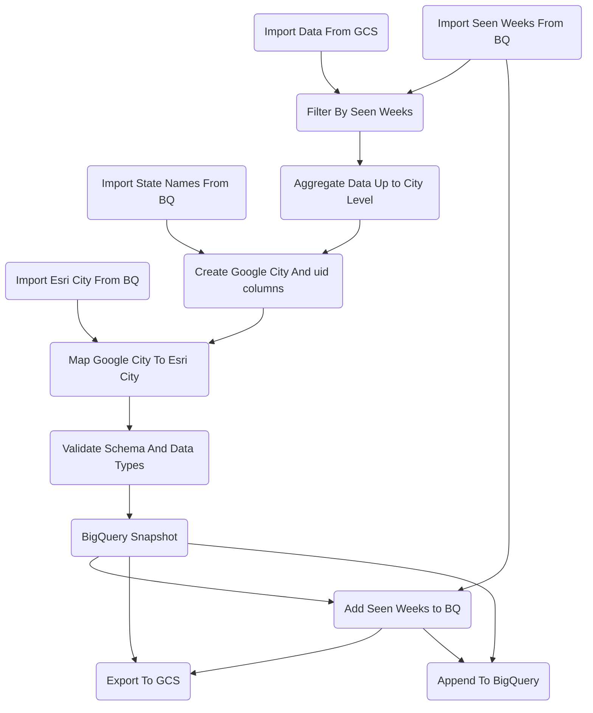

T

## Flowchart

```mermaid
flowchart TD
id1(Import Data From GCS)
id2(Import State Names From BQ)
id3(Import Seen Weeks From BQ)
id4(Import Esri City From BQ)
id5(Filter By Seen Weeks)
id1 --> id5
id3 --> id5
id6(Aggregate Data Up to City Level)
id5 --> id6
id7(Create Google City And uid columns)
id6 --> id7
id2 --> id7
id8(Map Google City To Esri City)
id7 --> id8
id4 --> id8
id9(Validate Schema And Data Types)
id8 --> id9
id10(BigQuery Snapshot)
id9 --> id10
id11(Add Seen Weeks to BQ)
id10 --> id11
id3 --> id11
id12(Export To GCS)
id11 --> id12
id13(Append To BigQuery)
id11 --> id13
id10 --> id12
id10 -->id13

```