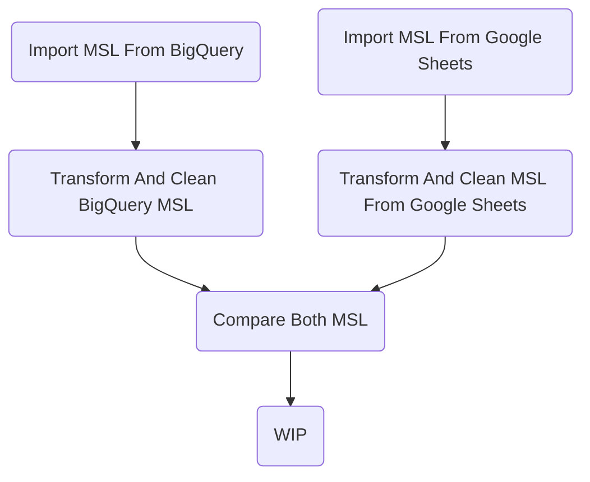

# MSL Pipeline Documentation

## Summary
The MSL pipeline has 2 primary purposes. The first purpose is to have an up to data MSL in available in BigQuery. The second purpose is to track changes made to the MSL over time.

## Flowchart

## Extra Details In Flowchart
WIP -> Will do once pipeline is finalized.

## Links Associated To The MSL Pipeline

### BigQuery
Link: [Up to date MSL](https://console.cloud.google.com/bigquery?referrer=search&authuser=0&project=orbital-airfoil-393318&ws=!1m5!1m4!4m3!1sorbital-airfoil-393318!2ssilver_layer!3smsl&rapt=AEjHL4P2Aj3Y_3y1lr9qjXMkE81QjHY1rnPyy4fSUwgdCq-kZxQ0eVvXh6B5msvwDWyBpmXY1OatLBl-_UhelmLO-0yf5_EmwNwVLIrCvqetfkngIwSIWV8)

The Table reference in BQ is `silver_layer.msl`

Link: [Historical Changes MSL](https://console.cloud.google.com/bigquery?referrer=search&authuser=0&project=orbital-airfoil-393318&ws=!1m5!1m4!4m3!1sorbital-airfoil-393318!2ssilver_layer!3smsl_historical&rapt=AEjHL4P2Aj3Y_3y1lr9qjXMkE81QjHY1rnPyy4fSUwgdCq-kZxQ0eVvXh6B5msvwDWyBpmXY1OatLBl-_UhelmLO-0yf5_EmwNwVLIrCvqetfkngIwSIWV8)

The Table reference in BQ is `silver_layer_historical`

### MSL Google Sheet
Link: [MSL Google Sheet](https://docs.google.com/spreadsheets/d/1g_R4e28nAeWWPMXmLJAhQNEvxdVL8B00wfMLKMoGBjw/edit?pli=1#gid=1385454884)
