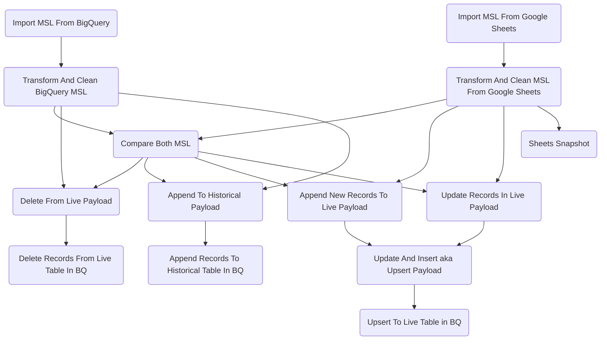

# MSL Pipeline Documentation

## Summary
The MSL pipeline has 2 primary purposes. The first purpose is to have an up to data MSL in available in BigQuery. The second purpose is to track changes made to the MSL over time.

## Flowchart

## Extra Details In Flowchart
1. Two versions of the MSL are initially loaded into BigQuery; the `live` version from the `silver_layer.msl` table in BigQuery and version from the Google Sheets source file which I'll call the `sheets` version.
2. The 2 verions are then cleaned to ensure consistenty when comparsions are done between the 2 versions.
   
   ***Live Transformations***
    * Normalizes data types.
    * Standardizes characters and removes characters in all entries
    that are not on standard US/CA keyboard.
    * Removes leading/trailing whitespaces for all entries
    * Changes None values and NA type values to be consisent with the output from the msl_live_import block.
  
   ***Sheets Transformations***
    *  Ensures columns are in snake case.
    *  Normalizes data types
    *  Removes .0 values at the end of a string
    *  Reformats the update_date column to match what is in BQ.
    *  Standardizes characters and removes characters in all entries
    that are not on standard US/CA keyboard
    * Standardizes boolean logic values
    * Removes leading/trailing whitespaces for all entries
3. The 2 versions are compared and follow this process:
    * The first step is to loop through all of the p_id values
    from the data argument and check if that p_id is in the live
    argument's p_id. If the p_ids match, then each row and entry in
    th row is compared to one another. If the rows match, then nothing is done.
    If the rows do not match, then that means that the row has changed
    and we must update the live table with the new changes.

    * If the ids do not match, then the first process that is done
    is to check if a new entry is added. The p_ids are all unique meaning
    that a new store cannot overide a previously established store/p_id combo.
    This means that if a new p_id is added, then the digits section of the p_id
    will be larger than any of the digits that are currently seen in live table.
    One thing to note, is that in the p_id, there are 4 abbreviations,
    GCAN,GRCAN,GUSC,and GRUSC. So we have to check for each of those 4 
    abbreviations and see if this new id has a larger value than the last value
    in that associated list of values.

    * The final process is to check if there are any values that are both
    not in the data argument or in the list of p_ids that have been
    added to the MSL google sheet. If that is the case, then that means
    those specific p_ids have been deleted.

    * Finally, we construct a pandas DataFrame out of the list of dictionaries
    build_payload_map to be used in making payloads in downstream blocks.

4. The next blocks construct payloads for corresponding `Table`, `actions`. 
5. The payloads are then applied to the `live` and `historical` tables in BigQuery.

## Links Associated To The MSL Pipeline

### BigQuery
Link: [Up to date MSL](https://console.cloud.google.com/bigquery?referrer=search&authuser=0&project=orbital-airfoil-393318&ws=!1m5!1m4!4m3!1sorbital-airfoil-393318!2ssilver_layer!3smsl&rapt=AEjHL4P2Aj3Y_3y1lr9qjXMkE81QjHY1rnPyy4fSUwgdCq-kZxQ0eVvXh6B5msvwDWyBpmXY1OatLBl-_UhelmLO-0yf5_EmwNwVLIrCvqetfkngIwSIWV8)

The Table reference in BQ is `silver_layer.msl`

Link: [Historical Changes MSL](https://console.cloud.google.com/bigquery?referrer=search&authuser=0&project=orbital-airfoil-393318&ws=!1m5!1m4!4m3!1sorbital-airfoil-393318!2ssilver_layer!3smsl_historical&rapt=AEjHL4P2Aj3Y_3y1lr9qjXMkE81QjHY1rnPyy4fSUwgdCq-kZxQ0eVvXh6B5msvwDWyBpmXY1OatLBl-_UhelmLO-0yf5_EmwNwVLIrCvqetfkngIwSIWV8)

The Table reference in BQ is `silver_layer_historical`

### MSL Google Sheet
Link: [MSL Google Sheet](https://docs.google.com/spreadsheets/d/1g_R4e28nAeWWPMXmLJAhQNEvxdVL8B00wfMLKMoGBjw/edit?pli=1#gid=1385454884)
