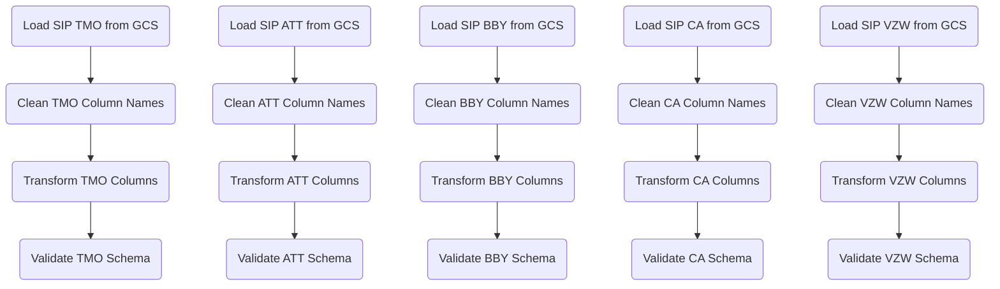

## Flowchart

```mermaid
flowchart TD

id1_tmo(Load SIP TMO from GCS)
id2_tmo(Clean TMO Column Names)
id3_tmo(Transform TMO Columns)
id4_tmo(Validate TMO Schema)
id1_tmo --> id2_tmo--> id3_tmo-->id4_tmo

id1_att(Load SIP ATT from GCS)
id2_att(Clean ATT Column Names)
id3_att(Transform ATT Columns)
id4_att(Validate ATT Schema)
id1_att --> id2_att--> id3_att-->id4_att

id1_bby(Load SIP BBY from GCS)
id2_bby(Clean BBY Column Names)
id3_bby(Transform BBY Columns)
id4_bby(Validate BBY Schema)
id1_bby --> id2_bby--> id3_bby-->id4_bby

id1_ca(Load SIP CA from GCS)
id2_ca(Clean CA Column Names)
id3_ca(Transform CA Columns)
id4_ca(Validate CA Schema)
id1_ca --> id2_ca--> id3_ca-->id4_ca


id1_vzw(Load SIP VZW from GCS)
id2_vzw(Clean VZW Column Names)
id3_vzw(Transform VZW Columns)
id4_vzw(Validate VZW Schema)
id1_vzw --> id2_vzw--> id3_vzw-->id4_vzw


```