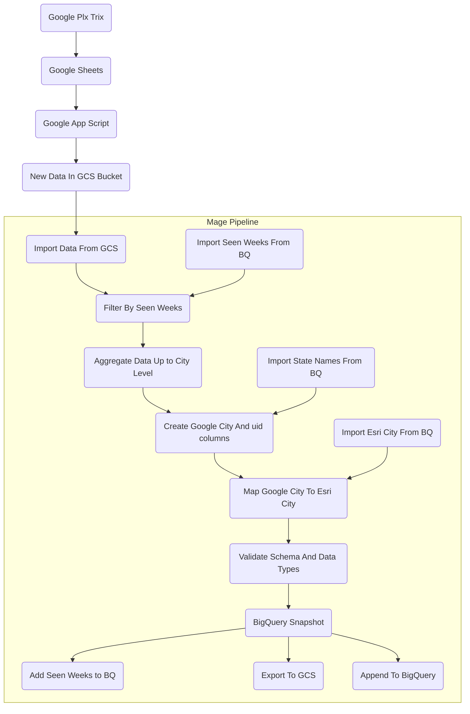

m
# Us Activations Pipeline Documentation

## Summary
The US activations pipeline takes data from a Google Plx Trix and brings that data into BigQuery. The the pipeline itself is shared with the CA activations as the data structure and type of data is essentially identical.

## Flowchart

## Extra Details In Flowchart
WIP

Be sure to mention how the uid is created,
Any joins,
Any filters,
etc

