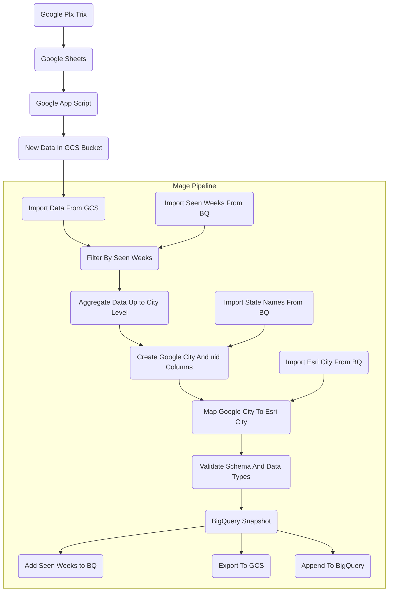

# US Activations Pipeline Documentation

## Summary
The US activations pipeline takes data from a Google Plx Trix and brings that data into BigQuery. The the pipeline itself is shared with the CA activations as the data structure and type of data is essentially identical.

## Flowchart

## Extra Details In Flowchart
1. A google plx trix is setup to pull the activations data into a google sheet eveery week on Tuesday.
2. A google app script is used to extract the data from the plx trix to be stored in GCS as well as used to fire off the pipeline. Any new file added into the `raw` subfolders of the `activationz` bucket is what is used to trigger a pipeline run.
3. Once the new data from GCS is imported into the Mage pipeline, we also import the seen weeks of the activations data from the table `silver_layer.activations_seen_weeks`. By doing this, we avoid we avoid duplicate records and make sure that each pipeline run contains new data.
4. We than aggregate the data up from the postal code data to the city level as it allows to create a unique id (`uid`) for our data. There are too many empty and null field in the postal code data to make that level of granularity meaningful.
5. We then import state names and their long form from the `silver_layer.state_name_abbreviation` table in BigQuery. The aggregated data from the previous step is joined with this table using a `LEFT JOIN` on each datasets corresponding `state` columns. The result is a dataset that preserves the aggregated data from the previous step while adding columns from the `state_name_abbreviation` where states match.
6. A new column called `google_city` is created in the new dataset. This column is created by concatenating the columns `city` and `state`.
7. The `uid` is then created from the concatenation of the columns `parter_display_name`,`google_city`,`product_line`, and `activation_date`.
8. We then import  `google_city` to `esri_city` mapping from the `silver_layer.google_to_esri_city_mapping` table in BigQuery. The dataset from the previous stage is then joined using `LEFT JOIN` on each tables `google_city` column.
9. The dataset's schema and columns then get validated before exporting to BigQuery.
10. A snapshot of the data is then taken and exported to GCS.
11. The seen weeks and dataset then are both appended to BigQuery.

## Links associated To The US Activations Pipeline

### Google Cloud Storage(GCS)

Link: [US Activations GCS](https://console.cloud.google.com/storage/browser/activationz/US_wkly?authuser=0&project=orbital-airfoil-393318&pageState=(%22StorageObjectListTable%22:(%22f%22:%22%255B%255D%22))&prefix=&forceOnObjectsSortingFiltering=false)

### BigQuery

Link: [Activations Table In BigQuery](https://console.cloud.google.com/bigquery?referrer=search&authuser=0&project=orbital-airfoil-393318&ws=!1m5!1m4!4m3!1sorbital-airfoil-393318!2ssilver_layer!3sactivations&rapt=AEjHL4M3f1x-ugX3r2tv7CC0cfTq6BB4R8m1vz8I7eRwRzIIlweBDeDyb1Szukb44sXCvkGPZQRqkkldaGjC0hco7N8INVwB2iIz_1GXSr4oQIBheX6SdLo&pli=1)

Link: [Activations seen weeks](https://console.cloud.google.com/bigquery?referrer=search&authuser=0&project=orbital-airfoil-393318&ws=!1m5!1m4!4m3!1sorbital-airfoil-393318!2ssilver_layer!3sactivations_seen_weeks&rapt=AEjHL4M3f1x-ugX3r2tv7CC0cfTq6BB4R8m1vz8I7eRwRzIIlweBDeDyb1Szukb44sXCvkGPZQRqkkldaGjC0hco7N8INVwB2iIz_1GXSr4oQIBheX6SdLo&pli=1)

Link: [State Name Abbreviations](https://console.cloud.google.com/bigquery?referrer=search&authuser=0&project=orbital-airfoil-393318&ws=!1m5!1m4!4m3!1sorbital-airfoil-393318!2ssilver_layer!3sstate_name_abbreviation&rapt=AEjHL4M3f1x-ugX3r2tv7CC0cfTq6BB4R8m1vz8I7eRwRzIIlweBDeDyb1Szukb44sXCvkGPZQRqkkldaGjC0hco7N8INVwB2iIz_1GXSr4oQIBheX6SdLo&pli=1)

Link: [Google City To Esri City](https://console.cloud.google.com/bigquery?referrer=search&authuser=0&project=orbital-airfoil-393318&ws=!1m5!1m4!4m3!1sorbital-airfoil-393318!2ssilver_layer!3sgoogle_to_esri_city_mapping&rapt=AEjHL4M3f1x-ugX3r2tv7CC0cfTq6BB4R8m1vz8I7eRwRzIIlweBDeDyb1Szukb44sXCvkGPZQRqkkldaGjC0hco7N8INVwB2iIz_1GXSr4oQIBheX6SdLo&pli=1)

### Google Plx Trix
Link: [Google Plx Trix And Google Sheets](https://docs.google.com/spreadsheets/d/1fCZYXlIVGgM5Js712ehdhkABy0zDDv9lReyW2O9cjaA/edit?resourcekey=0-gw_FuZqGmF7pg7zGv5W_bg#gid=156467221)

