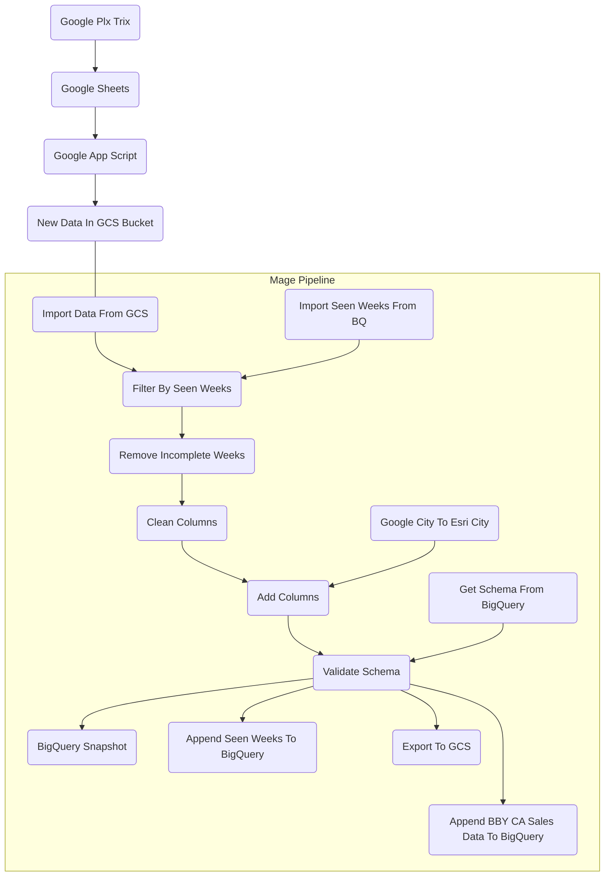

# Summary
The BBY US pipeline takes sellout data from a Google Plx Trix and brings that data into BigQuery. Note that the BBY CA and BBY US pipeline mirror each other.

## Flowchart

## Extra Details In Flowchart
1. A google plx trix is setup to pull the BBY US sellout data into a google sheet every week on Tuesday.
2. A google app script is used to extract the data from the plx trix to be stored in GCS as well as used to fire off the pipeline. Any new file added into the `raw` subfolders of the `sell-through` bucket is what is used to trigger a pipeline run.
3. Once the new data from GCS is imported into the Mage pipeline, we also import the seen weeks of the BBY US sales data from the table `silver_layer.bby_sellout_seen_weeks`. By doing this, we avoid we avoid duplicate records and make sure that each pipeline run contains new data.
4. We then filter the data to leave out incomplete weeks or more specifically dates that are greater or equal to 7 days from the GCS file creation. We want a weeks worth of data only to keep consistency when doing week over week comparisons.
5. The columns from the BBY US Sellout data are then converted to snake case and then filtered to only the needed columns.
6. The BBY US Sellout data is then joined with the `google_to_esri_city_mapping` table from BigQuery using a `LEFT JOIN` on their corresponding `google_city` columns. `esri_city` is joined in from the `google_to_esri_city_mapping` table. The `city_state` column in then removed. The `uid` column is then created by concatenating the `week_start_date`,`ice_store_id`, and `product_line` columns.
7. The schema is then validated for proper structure and data types.
8. A snapshot of the data is then exported to GCS.
9. Seen weeks, and BBY Sellout Data are then appended to BigQuery.

## Links Associated To The BBY US Pipeline

### Google Cloud Storage

Link: [GCS Buckets](https://console.cloud.google.com/storage/browser/sell-through/bby_sellout/ca?pageState=(%22StorageObjectListTable%22:(%22f%22:%22%255B%255D%22))&authuser=0&project=orbital-airfoil-393318&prefix=&forceOnObjectsSortingFiltering=false)

### BigQuery

Link: [BBY Sellout Main Table](https://console.cloud.google.com/bigquery?referrer=search&authuser=0&project=orbital-airfoil-393318&ws=!1m5!1m4!4m3!1sorbital-airfoil-393318!2ssilver_layer!3sbby_sellout&rapt=AEjHL4M3f1x-ugX3r2tv7CC0cfTq6BB4R8m1vz8I7eRwRzIIlweBDeDyb1Szukb44sXCvkGPZQRqkkldaGjC0hco7N8INVwB2iIz_1GXSr4oQIBheX6SdLo&pli=1)

Link: [BBY Seen Weeks](https://console.cloud.google.com/bigquery?referrer=search&authuser=0&project=orbital-airfoil-393318&ws=!1m5!1m4!4m3!1sorbital-airfoil-393318!2ssilver_layer!3sbby_sellout_seen_weeks&rapt=AEjHL4M3f1x-ugX3r2tv7CC0cfTq6BB4R8m1vz8I7eRwRzIIlweBDeDyb1Szukb44sXCvkGPZQRqkkldaGjC0hco7N8INVwB2iIz_1GXSr4oQIBheX6SdLo&pli=1)

Link: [Google To Esri City Mapping](https://console.cloud.google.com/bigquery?referrer=search&authuser=0&project=orbital-airfoil-393318&ws=!1m5!1m4!4m3!1sorbital-airfoil-393318!2ssilver_layer!3sgoogle_to_esri_city_mapping&rapt=AEjHL4M3f1x-ugX3r2tv7CC0cfTq6BB4R8m1vz8I7eRwRzIIlweBDeDyb1Szukb44sXCvkGPZQRqkkldaGjC0hco7N8INVwB2iIz_1GXSr4oQIBheX6SdLo&pli=1)

### Google Plx Trix
Link: [Google Plx Trix And Google Sheets](https://docs.google.com/spreadsheets/d/1fCZYXlIVGgM5Js712ehdhkABy0zDDv9lReyW2O9cjaA/edit?resourcekey=0-gw_FuZqGmF7pg7zGv5W_bg#gid=156467221)