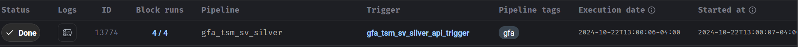

# How To Trigger Pipelines

## TMO Pipelines

***TMO Mobile One Sales:***

- Data gets added to a google sheet from the dealer.
- Triggered from a google app script.
- Set to run `every Tuesday at ~9-10am EST`.
- To manually trigger, run the `TMOM1SALESPULL`.

***TMO Mobile One Inventory:***
- Data gets added to a google sheet from the dealer.
- Triggered from a google app script.
- Set to run `every Tuesday at ~9-10am EST`.
- To manually trigger, run the `TMOM1INVPULL`.

***TMO GP Mobile Sales:***

- Data gets sent via email in `csv` format.
- To trigger(**for now**), download the `sales` csv and then rename the file as follows: `TMOGPSALES - mm.dd.yyyy - raw.csv`. As an exmaple, at the time of writing this, the day is `10/10/2024`, therefore the file name should be `TMOGPSALES - 10.10.2024 - raw.csv`.
- To trigger the pipeline, place this file into a bucket called `the-beach-stg`.
- This data is provided to us with very consistent formatting, so usually no intervention aside from changing the name of the file is needed.

***TMO GP Mobile Inventory:***
- Data gets sent via email in `csv` format.
- To trigger(**for now**), download the `inventory` csv and then rename the file as follows: `TMOGP Inventory - mm.dd.yyyy - raw.csv`. As an exmaple, at the time of writing this, the day is `10/10/2024`, therefore the file name should be `TMOGP Inventory - 10.10.2024 - raw.csv`.
- To trigger the pipeline, place this file into a bucket called `the-beach-stg`.
- This data is provided to us with very consistent formatting, so usually no intervention aside from changing the name of the file is needed.

***TMO GP Mobile Inventory Summary:***
- Data gets sent via email in `csv` format.
- To trigger(**for now**), download the `inventory summary` csv and then rename the file as follows: `TMOGPSUM Inventory - mm.dd.yyyy - raw.csv`. As an exmaple, at the time of writing this, the day is `10/10/2024`, therefore the file name should be `TMOGPSUM Inventory - 10.10.2024 - raw.csv`.
- To trigger the pipeline, place this file into a bucket called `the-beach-stg`.
- This data is provided to us with very consistent formatting, so usually no intervention aside from changing the name of the file is needed.

***TMO Connectivity Source Sales:***
- Data gets sent via email in `xlsx` format.
- To trigger(**for now**), download the `sales` tab of the excel file to a `csv` file.
- Make sure that no columns are missing from the data (**the data sent is sometimes inconsistent**).
- Format the `sku code` column to a number i.e. no scientific notation.
- Format the `msrp` column(**must be integer**) such that it's just an integer i.e.(no $ or , in the cells)
- Rename the file as follows: `TMOCON Sales Data - mm.dd.yyyy - raw.csv`.As an exmaple, at the time of writing this, the day is 10/10/2024, therefore the file name should be
`TMOCON Sales Data - 10.10.2024 - raw.csv`.

- To trigger the pipeline, place this file into a bucket called `the-beach-stg`.

***TMO Connectivity Source Inventory:***
- Data gets sent via email in `xlsx` format.
- To trigger(**for now**), download the `inventory` tab of the excel file to a `csv` file.
- Make sure that no columns are missing from the data (**the data sent is sometimes inconsistent**).
- Format the `sku code`, `Delivery Order`, `STO` and `Serial Number` columns to a number i.e. no scientific notation.

- Rename the file as follows: `TMOCON Inventory - mm.dd.yyyy - raw.csv`.As an exmaple, at the time of writing this, the day is 10/10/2024, therefore the file name should be
`TMOCON Inventory - 10.10.2024 - raw.csv`.

- To trigger the pipeline, place this file into a bucket called `the-beach-stg`.

***TMO Wireless Vision Sales:***
- Data gets sent via email in `xlsx` format.
- To trigger(**for now**), download the `sales` tab of the excel file to a `csv` file.
- Format the `sku code`,`imei`, and `employee number` columns to a number i.e. no scientific notation.
- Make sure the `msrp` column is still a `float`(**keep format the same**) but ensure that there are no commas in the cells.
- Rename the file as follows: `TMOWV Sales - mm.dd.yyyy - raw.csv`. As an exmaple, at the time of writing this, the day is 10/10/2024, therefore the file name should be `TMOWV Sales - 10.10.2024 - raw.csv`.
- To trigger the pipeline, place this file into a bucket called `the-beach-stg`.

***TMO Wireless Vision Inventory:***
- Data gets sent via email in `xlsx` format.
- To trigger(**for now**), download the `inventory` tab of the excel file to a `csv` file.
- Rename the file as follows: `TMOWV Inventory - mm.dd.yyyy - raw.csv`. As an exmaple, at the time of writing this, the day is 10/10/2024, therefore the file name should be `TMOWV Inventory - 10.10.2024 - raw.csv`.
- To trigger the pipeline, place this file into a bucket called `the-beach-stg`.

## Bell Pipelines

***Bell Sales Data:***
- Data gets sent via email in `csv` format.
- Rename the file as follows: `Bell Sales - mm.dd.yyyy - raw.csv`. 
As an exmaple, at the time of writing this, the day is 10/22/2024, 
therefore the file name should be `Bell Sales - 10.22.2024 - raw.csv`.
- To trigger the pipeline, place this file into a bucket called the-beach-stg.

## Best Buy Pipelines
***Best Buy Canada:***
- The pipeline can be manually triggered by running the `BBY CA Pull` 
Google App Script. 
- The pipeline can also be triggered by downloading the data from the google sheet
and then renaming it as follows `CA BBY_sellout - mm.dd.yyyy - raw.csv`. 
As an exmaple, at the time of writing this, the day is 10/22/2024, 
therefore the file name should be `CA BBY_sellout - 10.22.2024 - raw.csv`.
- To trigger the pipeline, place this file into a bucket called the-beach-stg.

***Best Buy US:***
- The pipeline can be manually triggered by running the `BBY US Pull` 
Google App Script. 
- The pipeline can also be triggered by downloading the data from the google sheet
and then renaming it as follows `US BBY_sellout - mm.dd.yyyy - raw.csv`. 
As an exmaple, at the time of writing this, the day is 10/22/2024, 
therefore the file name should be `US BBY_sellout - 10.22.2024 - raw.csv`.
- To trigger the pipeline, place this file into a bucket called the-beach-stg.

## Activations Pipelines

**CA Activations:**

- The pipeline can be manually triggered by running the `CA Activations Pull` 
Google App Script. 
- The pipeline can also be triggered by downloading the data from the google sheet
and then renaming it as follows `CA Carrier Activations - mm.dd.yyyy - raw.csv`. 
As an exmaple, at the time of writing this, the day is 10/22/2024, 
therefore the file name should be `CA Carrier Activations - 10.22.2024 - raw.csv`.
- To trigger the pipeline, place this file into a bucket called the-beach-stg.

***US Activations:***

- The pipeline can be manually triggered by running the `US Activations Pull` 
Google App Script. 
- The pipeline can also be triggered by downloading the data from the google sheet
and then renaming it as follows `US Carrier Activations - mm.dd.yyyy - raw.csv`. 
As an exmaple, at the time of writing this, the day is 10/22/2024, 
therefore the file name should be `US Carrier Activations - 10.22.2024 - raw.csv`.
- To trigger the pipeline, place this file into a bucket called the-beach-stg.

## AT&T Pipelines
**ATT Sales Pipeline:**

- The pipeline can be manually triggered by running the `ATT Sales Pull` 
Google App Script. 
- The pipeline can also be triggered by downloading the data from the google sheet
and then renaming it as follows `ATT dailysales - mm.dd.yyyy - raw.csv`. 
As an exmaple, at the time of writing this, the day is 10/22/2024, 
therefore the file name should be `ATT dailysales - 10.22.2024 - raw.csv`.
- To trigger the pipeline, place this file into a bucket called the-beach-stg.

## GFA Pipelines
**GFA Data Pipeline:**

- The pipeline can be manually triggered by running the `GFA GCS Dump` 
Google App Script.
- The pipeline can also be triggered by downloading the data from the google sheet
and then renaming it as follows `GFA Data - mm.dd.yyyy - raw.csv`. 
As an exmaple, at the time of writing this, the day is 10/22/2024, 
therefore the file name should be `GFA Data - 10.22.2024 - raw.csv`.
- To trigger the pipeline, place this file into a bucket called the-beach-stg.

**GFA Store Visits Pipeline:**

- The pipeline can be manually triggered by running the `GFA Store Visits Dump` 
Google App Script.
- The pipeline can also be triggered by downloading the data from the google sheet
and then renaming it as follows `Store Visits - mm.dd.yyyy - raw.csv`. 
As an exmaple, at the time of writing this, the day is 10/22/2024, 
therefore the file name should be `Store Visits - 10.22.2024 - raw.csv`.
- To trigger the pipeline, place this file into a bucket called the-beach-stg.

## Other Pipelines
**Note 1** for some other pipelines you will need access to [MAGE](https://github.com/CarrierOps/1P-Wiki/blob/main/ByteSizedLearning/TinyTechTidbits/CodeMunchies/hello-mage.md).

**Note 2:** If you need to manually trigger pipelines that are not listed above, please contact Michael or Thomas.

**Example Of A Successful Run:**
<figure align="center">
    
  <figcaption>Successful Mage Pipeline Run</figcaption>
</figure>

- To see if your pipeline run is successful, on the side navigtion bar of mage go to `pipeline runs`. 
- If you pipeline you triggered have a status of done as seen in the figure above, then the pipeline run has been successful 😃. 
- If not, you may have to debug in which you will need to click the logs button beside the status indicator or once again contact Michael or Thomas.